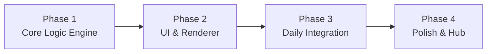

# Document 2: Game 1 (Tango) Blueprint

> **Game:** Tango — Binary Logic Grid Puzzle  
> **Grid:** 6×6  
> **Symbols:** Sun (☀️) and Moon (🌙)  
> **Phases:** 4  
> **Estimated Total Effort:** ~3–4 sessions  

---

## Game Rules Recap

1. **Balance:** Every row and column must contain exactly **3 Suns and 3 Moons**
2. **No three-in-a-row:** Max 2 identical symbols adjacent (horizontally or vertically)
3. **Constraint signs:**
   - **= (equals):** Adjacent cells must have the **same** symbol
   - **× (cross):** Adjacent cells must have **different** symbols
4. **Unique solution:** Every puzzle is solvable through pure logic, no guessing

---

## Phase Overview



| Phase | Focus | Key Deliverables | Test Strategy |
|-------|-------|------------------|---------------|
| **Phase 1** | Logic engine | Data model, validator, solver, generator | Vitest: 100% logic coverage |
| **Phase 2** | UI & Interaction | Grid rendering, tap cycles, constraint markers, animations | Playwright: interaction flows |
| **Phase 3** | Daily system | Seeded RNG, JSON bank, save/load, timer, difficulty | Vitest + Playwright: daily reset scenarios |
| **Phase 4** | Polish & Integration | Confetti, results modal, streak, hub card, responsive | Visual + user feedback |

---

## Phase 1: Core Logic Engine

### Objective
Build the pure-logic backend for Tango with zero DOM dependencies. All functions must be testable in isolation.

### Files

| File | Responsibility |
|------|----------------|
| `src/games/tango/tango-logic.js` | Board model, rule validation, win detection |
| `src/games/tango/tango-solver.js` | Constraint-propagation solver (verify unique solution) |
| `src/games/tango/tango-generator.js` | Algorithmic puzzle generator |
| `tests/tango/tango-logic.test.js` | Logic unit tests |
| `tests/tango/tango-solver.test.js` | Solver unit tests |
| `tests/tango/tango-generator.test.js` | Generator unit tests |

### Data Model

```js
// Board: 6×6 2D array
// Cell values: null (empty), 'sun', 'moon'
const board = [
  [null, 'sun', null, null, 'moon', null],
  [null, null, null, null, null, null],
  // ... 6 rows
];

// Constraints: list of between-cell relationships
const constraints = [
  { r1: 0, c1: 2, r2: 0, c2: 3, type: 'same' },     // =
  { r1: 1, c1: 4, r2: 2, c2: 4, type: 'different' },  // ×
  // ...
];

// Puzzle = { board, constraints, solution }
```

### Acceptance Criteria

- [ ] `isValidPlacement(board, row, col, symbol)` — returns `true`/`false` checking all 3 rules
- [ ] `checkWin(board)` — returns `true` when fully filled and valid
- [ ] `solve(board, constraints)` — returns the unique solution or `null`
- [ ] `generate(difficulty, rng)` — returns a valid puzzle with exactly one solution
- [ ] All validators enforce: balance rule, no-three rule, constraint signs
- [ ] Generator produces puzzles at 3 difficulty levels by varying pre-filled cells and constraint count
- [ ] 100+ generated puzzles tested for unique solvability

---

## Phase 2: UI & Renderer

### Objective
Build the visual game board and wire up user interactions. The player should be able to play a complete game visually.

### Files

| File | Responsibility |
|------|----------------|
| `src/games/tango/tango-renderer.js` | DOM grid builder, cell rendering, constraint markers |
| `src/games/tango/tango.js` | Game controller (lifecycle, event wiring) |
| `src/styles/tango.css` | Game-specific styles |
| `src/styles/game-shell.css` | Shared game header/controls |

### UI Components

```
┌──────────────────────────────┐
│  ← Back    TANGO     00:32  │  ← Game shell (shared)
├──────────────────────────────┤
│                              │
│      ☀️  🌙  ·  =  ·  ☀️     │  ← 6×6 grid with constraint
│      ·   ·   ·  ×  ·  ·     │     markers between cells
│      🌙  ·   ·  ·  ·  ·     │
│      ·   ·   ☀️  ·  🌙  ·    │
│      ·   ·   ·  ·  ·  ·     │
│      ·   ☀️  ·  ·  ·  🌙    │
│                              │
├──────────────────────────────┤
│      [Undo]    [Reset]       │  ← Controls bar
└──────────────────────────────┘
```

### Interaction Model

| Action | Result |
|--------|--------|
| **Tap empty cell** | Place Sun (☀️) |
| **Tap Sun cell** | Switch to Moon (🌙) |
| **Tap Moon cell** | Clear cell (back to empty) |
| **Tap pre-filled cell** | No action (locked) |
| **Invalid placement** | Cell shakes + red flash (400ms) |
| **Win detected** | Stop timer → confetti → results modal |

### Constraint Markers

- **= sign:** Small "=" icon on the border between two cells (horizontal or vertical)
- **× sign:** Small "×" icon on the border between two cells
- Rendered as absolutely-positioned elements on cell borders
- Use `--text-secondary` color, subtle but visible

### Cell Animation Specs

| Animation | Trigger | Detail |
|-----------|---------|--------|
| Tap press | On pointerdown | `transform: scale(0.92)`, 80ms ease-out |
| Symbol appear | On placement | `opacity: 0→1` + `scale: 0.7→1.0`, 180ms ease-out |
| Symbol switch | Sun↔Moon | Quick fade-out (100ms) + fade-in (150ms) with scale |
| Error shake | Invalid rule | `translateX` keyframe: 0→-6→6→-4→4→-2→2→0, 400ms |
| Error flash | Invalid rule | Cell background flashes `--accent-red` at 30% opacity, 400ms |
| Row/col highlight | Rule violation | Brief highlight of the violating row/column, 600ms fade |

### Acceptance Criteria

- [ ] 6×6 grid renders correctly with proper spacing
- [ ] Tap cycle works: empty → sun → moon → empty
- [ ] Pre-filled cells are visually distinct and non-interactive
- [ ] Constraint markers (= and ×) display on correct borders
- [ ] Error shake plays on invalid placement
- [ ] Win detection triggers when board is fully and correctly filled
- [ ] Undo button reverses last move
- [ ] Reset button clears all user-placed symbols (keeps pre-fills and constraints)
- [ ] Responsive: grid fills available width on mobile (min 44px cell tap targets)

---

## Phase 3: Daily Integration

### Objective
Wire the game into the daily puzzle system: seeded generation, JSON bank, save/load progress, timer, and difficulty.

### Files

| File | Responsibility |
|------|----------------|
| `src/shared/rng.js` | Seeded PRNG (mulberry32) |
| `src/shared/seed.js` | Date → deterministic seed |
| `src/shared/timer.js` | Start/stop/display timer |
| `src/shared/storage.js` | localStorage wrapper |
| `public/data/tango-levels.json` | 20 hand-crafted puzzles |

### Daily Puzzle Flow

```
1. Get today's date → "2026-04-18"
2. Check localStorage for saved progress:
   a. If saved date === today AND not completed → Resume
   b. If saved date === today AND completed → Show results
   c. Else → Generate new puzzle:
      i.  If dayNumber ≤ 20 → Load from JSON bank
      ii. Else → Generate via seeded RNG
3. Start timer (or resume from saved time)
4. Auto-save on every move: { date, board, timer, moves }
```

### Difficulty Calibration for Tango

| Level | Pre-filled cells | Constraint signs | Approx. solve time |
|-------|-----------------|-----------------|---------------------|
| **Easy** | 12–16 of 36 | 4–6 signs | 1–2 min |
| **Medium** | 8–11 of 36 | 3–5 signs | 2–4 min |
| **Hard** | 4–7 of 36 | 2–4 signs | 3–6 min |

### Acceptance Criteria

- [ ] Same date always produces the same puzzle
- [ ] Different dates produce different puzzles
- [ ] Progress persists across page refreshes
- [ ] Timer resumes from saved value
- [ ] Completed puzzles cannot be replayed (shows results)
- [ ] "New Puzzle" button generates a fresh non-daily puzzle for extra practice
- [ ] First 20 days pull from JSON bank correctly
- [ ] Day 21+ generates via seeded PRNG

---

## Phase 4: Polish & Hub Integration

### Objective
Complete the experience: celebration, results, streaks, hub card, responsive design, final testing.

### Files

| File | Responsibility |
|------|----------------|
| `src/shared/confetti.js` | Canvas-based confetti particles |
| `src/shared/modal.js` | Results modal component |
| `src/hub/hub.js` | Hub page with game cards |
| `src/styles/hub.css` | Hub styles |
| `src/main.js` | Entry point, router setup |
| `src/router.js` | Hash-based SPA router |
| `e2e/tango.spec.js` | End-to-end gameplay tests |

### Results Modal Content

```
┌──────────────────────────────┐
│         🎉 Solved!            │
│                              │
│     Time:    02:34           │
│     Moves:   28              │
│     Streak:  🔥 5            │
│                              │
│     [Play Again]  [Hub →]    │
└──────────────────────────────┘
```

### Streak Logic

```
On daily puzzle completion:
  lastDate = streak.lastPlayDate
  today = currentDate()
  
  if (lastDate === yesterday()):
    streak.current++
  else if (lastDate !== today):
    streak.current = 1
  
  streak.best = max(streak.best, streak.current)
  streak.lastPlayDate = today
```

### Confetti System

- **Renderer:** 2D Canvas overlay (full-screen, pointer-events: none)
- **Particles:** 80–120 rectangular confetti pieces
- **Colors:** Random from the game's pastel palette
- **Physics:** Gravity + random horizontal drift + rotation
- **Duration:** 2 seconds, then fade out
- **Trigger:** On `checkWin() === true`

### Hub Card for Tango

```
┌───────────────────────┐
│  [Tango Icon]         │
│                       │
│  Solve Tango →        │
│  🔥 5                 │
│                       │
│  [Status: ✓ / → ]    │
└───────────────────────┘
```

- Shows streak count with fire emoji
- Shows "Completed ✓" if today's puzzle is done, else "Solve Tango →"
- Click navigates to `#/tango`

### Acceptance Criteria

- [ ] Confetti plays on win with correct colors and physics
- [ ] Results modal shows time, moves, streak
- [ ] Streak increments correctly across days
- [ ] Hub page renders with Tango card showing correct status
- [ ] Router navigates between hub and Tango
- [ ] Mobile responsive: grid ≥ 44px cells, controls accessible
- [ ] Dark theme matches LinkedIn vibe
- [ ] E2E test: full game playthrough from hub → play → win → modal → hub
- [ ] Performance: 60fps on all animations

---

## Testing Summary

| Layer | Tool | Coverage Target |
|-------|------|----------------|
| **Logic** | Vitest | `tango-logic.js`: all rule validators, edge cases. `tango-solver.js`: known puzzles with verified solutions. `tango-generator.js`: 100+ generated puzzles verified solvable with unique solution |
| **UI** | Playwright | Tap cycle, error animations, win detection, timer, save/resume |
| **Visual** | Browser inspection | Dark theme colors, responsive layout, animation smoothness |
| **UX** | User feedback | "Does this feel like LinkedIn Tango?" after Phase 4 |

---

## Risk Register

| Risk | Mitigation |
|------|------------|
| Generator produces unsolvable puzzles | Solver validates every generated puzzle; reject and regenerate if not uniquely solvable |
| Generator is slow (>500ms) | Pre-generate and cache. Limit backtracking depth. Profile and optimize hot paths |
| Constraint propagation solver too complex | Start with simple backtracking + forward checking. Optimize only if speed is an issue on 6×6 |
| Touch targets too small on mobile | Enforce `min-width/height: 44px` on cells. Test on actual mobile viewport |
| Animation jank | Use CSS transforms/opacity only (compositor-friendly). Avoid layout-triggering properties |
