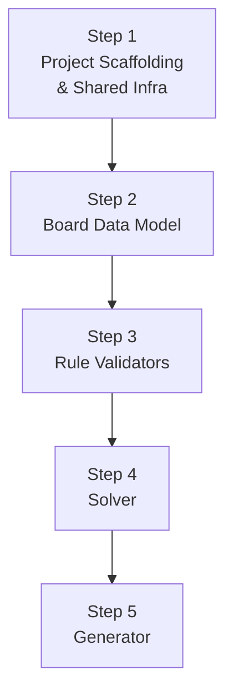

# Document 3: Phase 1 Micro-Plan — Tango Core Logic Engine

> **Game:** Tango  
> **Phase:** 1 of 4 — Core Logic Engine  
> **Goal:** Build the complete pure-logic backend with zero DOM dependencies  
> **Steps:** 5 sequential steps, each independently testable  
> **Testing:** Vitest — every function tested before moving to next step  

---

## Step Map



---

## Step 1: Project Scaffolding & Shared Infrastructure

### Objective
Initialize the Vite project, configure Vitest, and build the shared seeded PRNG module that all games will use.

### Actions

#### 1.1 — Initialize Vite Project

```bash
cd c:\Users\COWLAR\projects\linkedin-games
npm init -y
npm install --save-dev vite vitest
```

Create minimal `vite.config.js`:
```js
import { defineConfig } from 'vite';
export default defineConfig({
  root: '.',
  test: {
    include: ['tests/**/*.test.js'],
  },
});
```

Create minimal `index.html` (placeholder):
```html
<!DOCTYPE html>
<html lang="en">
<head>
  <meta charset="UTF-8">
  <meta name="viewport" content="width=device-width, initial-scale=1.0">
  <title>LinkedIn Games</title>
</head>
<body>
  <div id="app">Games coming soon...</div>
  <script type="module" src="/src/main.js"></script>
</body>
</html>
```

Create `src/main.js` (placeholder):
```js
console.log('LinkedIn Games — Initializing...');
```

Update `package.json` scripts:
```json
{
  "scripts": {
    "dev": "vite",
    "build": "vite build",
    "test": "vitest run",
    "test:watch": "vitest"
  }
}
```

#### 1.2 — Build Seeded PRNG

Create `src/shared/rng.js`:

The `mulberry32` algorithm — a fast, high-quality 32-bit PRNG:

```js
/**
 * Creates a seeded PRNG using mulberry32 algorithm.
 * @param {number} seed - Integer seed value
 * @returns {function} - Returns a function that produces [0, 1) floats
 */
export function createRNG(seed) {
  return function() {
    seed |= 0;
    seed = (seed + 0x6D2B79F5) | 0;
    let t = Math.imul(seed ^ (seed >>> 15), 1 | seed);
    t = (t + Math.imul(t ^ (t >>> 7), 61 | t)) ^ t;
    return ((t ^ (t >>> 14)) >>> 0) / 4294967296;
  };
}

/**
 * Converts a date string to a deterministic integer seed.
 * @param {string} dateStr - Format "YYYY-MM-DD"
 * @param {string} gameName - Game identifier for uniqueness
 * @returns {number} - Integer seed
 */
export function dateSeed(dateStr, gameName = 'tango') {
  const str = `${gameName}_${dateStr}`;
  let hash = 0;
  for (let i = 0; i < str.length; i++) {
    const char = str.charCodeAt(i);
    hash = ((hash << 5) - hash) + char;
    hash |= 0; // Convert to 32-bit integer
  }
  return Math.abs(hash);
}

/**
 * Shuffle an array in-place using Fisher-Yates with the provided RNG.
 * @param {Array} arr - Array to shuffle
 * @param {function} rng - PRNG function returning [0, 1)
 * @returns {Array} - The same array, shuffled
 */
export function shuffle(arr, rng) {
  for (let i = arr.length - 1; i > 0; i--) {
    const j = Math.floor(rng() * (i + 1));
    [arr[i], arr[j]] = [arr[j], arr[i]];
  }
  return arr;
}

/**
 * Pick a random integer in [min, max] (inclusive) using the provided RNG.
 */
export function randInt(min, max, rng) {
  return Math.floor(rng() * (max - min + 1)) + min;
}
```

#### 1.3 — Write RNG Tests

Create `tests/shared/rng.test.js`:

```
Tests to write:
- Determinism: same seed → same sequence (10 values)
- Different seeds → different sequences
- dateSeed("2026-04-18", "tango") always returns same integer
- dateSeed with different dates → different seeds
- dateSeed with different game names → different seeds
- shuffle produces all elements (no loss)
- shuffle with same seed → same order
- randInt stays within [min, max] over 1000 iterations
- Distribution: 10000 rng() calls should have mean ≈ 0.5 (within ±0.05)
```

### Checkpoint 1

| Check | Pass Criteria |
|-------|---------------|
| `npm run dev` starts | Vite dev server runs on localhost without errors |
| `npm run test` passes | All RNG tests green |
| Determinism verified | Same seed produces identical 100-value sequence across runs |
| Directory structure | `src/shared/rng.js`, `tests/shared/rng.test.js` exist |

---

## Step 2: Board Data Model

### Objective
Define the Tango board data structures and utility functions for creating, cloning, and displaying boards.

### File: `src/games/tango/tango-logic.js`

### Data Structures

```js
// Constants
export const SIZE = 6;
export const SYMBOLS = { SUN: 'sun', MOON: 'moon' };
export const CONSTRAINT_TYPES = { SAME: 'same', DIFF: 'different' };

/**
 * Create an empty 6×6 board.
 * @returns {Array<Array<null>>} - 6×6 grid of nulls
 */
export function createBoard() {
  return Array.from({ length: SIZE }, () => Array(SIZE).fill(null));
}

/**
 * Deep clone a board.
 */
export function cloneBoard(board) {
  return board.map(row => [...row]);
}

/**
 * Get the opposite symbol.
 */
export function opposite(symbol) {
  return symbol === SYMBOLS.SUN ? SYMBOLS.MOON : SYMBOLS.SUN;
}

/**
 * Check if a cell is within bounds.
 */
export function inBounds(r, c) {
  return r >= 0 && r < SIZE && c >= 0 && c < SIZE;
}

/**
 * Count occurrences of a symbol in a row.
 */
export function countInRow(board, row, symbol) {
  return board[row].filter(s => s === symbol).length;
}

/**
 * Count occurrences of a symbol in a column.
 */
export function countInCol(board, col, symbol) {
  let count = 0;
  for (let r = 0; r < SIZE; r++) {
    if (board[r][col] === symbol) count++;
  }
  return count;
}

/**
 * Check if the board is fully filled (no nulls).
 */
export function isFilled(board) {
  return board.every(row => row.every(cell => cell !== null));
}

/**
 * Pretty-print a board for debugging.
 * S = Sun, M = Moon, . = empty
 */
export function boardToString(board) {
  return board.map(row =>
    row.map(c => c === SYMBOLS.SUN ? 'S' : c === SYMBOLS.MOON ? 'M' : '.').join(' ')
  ).join('\n');
}
```

### Test File: `tests/tango/tango-logic.test.js` (Part 1)

```
Tests to write:
- createBoard() returns 6×6 grid of nulls
- cloneBoard() creates independent copy (modify clone, original unchanged)
- opposite('sun') === 'moon' and vice versa
- inBounds: (0,0)=true, (5,5)=true, (-1,0)=false, (6,0)=false
- countInRow: place 3 suns in row 0 → count('sun') === 3
- countInCol: place 2 moons in col 3 → count('moon') === 2
- isFilled: empty board → false, full board → true, one empty → false
- boardToString: known board produces expected string
```

### Checkpoint 2

| Check | Pass Criteria |
|-------|---------------|
| Data model tests | All pass |
| Type consistency | All functions handle `null`, `'sun'`, `'moon'` correctly |
| Clone independence | Modifying clone doesn't affect original |

---

## Step 3: Rule Validators

### Objective
Implement the three core Tango rules as independent validator functions, plus a combined validation function.

### File: `src/games/tango/tango-logic.js` (continued)

### Rule 1: Balance Rule

```js
/**
 * Check if placing `symbol` at (row, col) would violate the balance rule.
 * Balance: each row and column can have at most SIZE/2 of each symbol.
 *
 * @returns {{ valid: boolean, reason?: string }}
 */
export function checkBalance(board, row, col, symbol) {
  const maxPerLine = SIZE / 2; // = 3 for 6×6
  
  // Check row
  const rowCount = countInRow(board, row, symbol);
  if (rowCount >= maxPerLine) {
    return { valid: false, reason: `Row ${row} already has ${maxPerLine} ${symbol}s` };
  }
  
  // Check column
  const colCount = countInCol(board, col, symbol);
  if (colCount >= maxPerLine) {
    return { valid: false, reason: `Col ${col} already has ${maxPerLine} ${symbol}s` };
  }
  
  return { valid: true };
}
```

### Rule 2: No-Three-in-a-Row

```js
/**
 * Check if placing `symbol` at (row, col) would create 3+ identical
 * symbols in a row (horizontally or vertically).
 *
 * Logic: check the 2 cells before, 2 cells after, and the pairs
 * (before+after) to see if a triplet would form.
 *
 * @returns {{ valid: boolean, reason?: string }}
 */
export function checkNoThree(board, row, col, symbol) {
  // Horizontal check
  // Check: [col-2, col-1, col] all same?
  if (col >= 2 && board[row][col-1] === symbol && board[row][col-2] === symbol) {
    return { valid: false, reason: 'Three in a row horizontally (left)' };
  }
  // Check: [col-1, col, col+1] all same?
  if (col >= 1 && col < SIZE-1 && board[row][col-1] === symbol && board[row][col+1] === symbol) {
    return { valid: false, reason: 'Three in a row horizontally (center)' };
  }
  // Check: [col, col+1, col+2] all same?
  if (col <= SIZE-3 && board[row][col+1] === symbol && board[row][col+2] === symbol) {
    return { valid: false, reason: 'Three in a row horizontally (right)' };
  }
  
  // Vertical check (same logic transposed)
  if (row >= 2 && board[row-1][col] === symbol && board[row-2][col] === symbol) {
    return { valid: false, reason: 'Three in a row vertically (above)' };
  }
  if (row >= 1 && row < SIZE-1 && board[row-1][col] === symbol && board[row+1][col] === symbol) {
    return { valid: false, reason: 'Three in a row vertically (center)' };
  }
  if (row <= SIZE-3 && board[row+1][col] === symbol && board[row+2][col] === symbol) {
    return { valid: false, reason: 'Three in a row vertically (below)' };
  }
  
  return { valid: true };
}
```

### Rule 3: Constraint Signs

```js
/**
 * Check if placing `symbol` at (row, col) violates any constraint signs.
 *
 * @param {Array} constraints - List of { r1, c1, r2, c2, type }
 * @returns {{ valid: boolean, reason?: string }}
 */
export function checkConstraints(board, row, col, symbol, constraints) {
  for (const c of constraints) {
    let partnerR, partnerC;
    
    // Check if this cell is part of the constraint
    if (c.r1 === row && c.c1 === col) {
      partnerR = c.r2;
      partnerC = c.c2;
    } else if (c.r2 === row && c.c2 === col) {
      partnerR = c.r1;
      partnerC = c.c1;
    } else {
      continue; // This constraint doesn't involve our cell
    }
    
    const partner = board[partnerR][partnerC];
    if (partner === null) continue; // Partner not yet placed, can't violate
    
    if (c.type === CONSTRAINT_TYPES.SAME && partner !== symbol) {
      return { valid: false, reason: `Constraint '=' violated: (${row},${col}) must match (${partnerR},${partnerC})` };
    }
    if (c.type === CONSTRAINT_TYPES.DIFF && partner === symbol) {
      return { valid: false, reason: `Constraint '×' violated: (${row},${col}) must differ from (${partnerR},${partnerC})` };
    }
  }
  
  return { valid: true };
}
```

### Combined Validator

```js
/**
 * Master validation: checks all three rules.
 * @returns {{ valid: boolean, reason?: string }}
 */
export function isValidPlacement(board, row, col, symbol, constraints = []) {
  if (!inBounds(row, col)) return { valid: false, reason: 'Out of bounds' };
  if (board[row][col] !== null) return { valid: false, reason: 'Cell already occupied' };
  
  const balance = checkBalance(board, row, col, symbol);
  if (!balance.valid) return balance;
  
  const noThree = checkNoThree(board, row, col, symbol);
  if (!noThree.valid) return noThree;
  
  const constCheck = checkConstraints(board, row, col, symbol, constraints);
  if (!constCheck.valid) return constCheck;
  
  return { valid: true };
}

/**
 * Check if the entire board is valid and complete.
 * Used for win detection.
 */
export function checkWin(board, constraints = []) {
  if (!isFilled(board)) return false;
  
  for (let r = 0; r < SIZE; r++) {
    // Check balance in each row
    if (countInRow(board, r, SYMBOLS.SUN) !== SIZE / 2) return false;
    if (countInRow(board, r, SYMBOLS.MOON) !== SIZE / 2) return false;
    
    // Check no-three in each row
    for (let c = 0; c <= SIZE - 3; c++) {
      if (board[r][c] === board[r][c+1] && board[r][c+1] === board[r][c+2]) return false;
    }
  }
  
  for (let c = 0; c < SIZE; c++) {
    // Check balance in each column
    if (countInCol(board, c, SYMBOLS.SUN) !== SIZE / 2) return false;
    if (countInCol(board, c, SYMBOLS.MOON) !== SIZE / 2) return false;
    
    // Check no-three in each column
    for (let r = 0; r <= SIZE - 3; r++) {
      if (board[r][c] === board[r+1][c] && board[r+1][c] === board[r+2][c]) return false;
    }
  }
  
  // Check all constraints
  for (const con of constraints) {
    const a = board[con.r1][con.c1];
    const b = board[con.r2][con.c2];
    if (con.type === CONSTRAINT_TYPES.SAME && a !== b) return false;
    if (con.type === CONSTRAINT_TYPES.DIFF && a === b) return false;
  }
  
  return true;
}
```

### Test File: `tests/tango/tango-logic.test.js` (Part 2 — Validators)

```
Tests to write for checkBalance:
- Row with 3 suns → placing 4th sun returns invalid
- Row with 2 suns → placing 3rd sun returns valid
- Column with 3 moons → placing 4th moon returns invalid
- Empty board → any placement is valid for balance

Tests to write for checkNoThree:
- [sun, sun, ?] → placing sun at ? returns invalid
- [?, sun, sun] → placing sun at ? returns invalid
- [sun, ?, sun] → placing sun at ? returns invalid
- Vertical equivalents of all three
- [moon, sun, ?] → placing sun at ? returns valid (not three same)
- Edge cases: col=0, col=5, row=0, row=5

Tests to write for checkConstraints:
- Same constraint: partner=sun, placing sun → valid
- Same constraint: partner=sun, placing moon → invalid
- Diff constraint: partner=sun, placing moon → valid
- Diff constraint: partner=sun, placing sun → invalid
- Constraint where partner is null → always valid (not yet placed)
- Cell with no constraints → always valid

Tests to write for isValidPlacement (combined):
- Valid placement passes all 3 checks
- Fails if any single check fails
- Out-of-bounds returns invalid
- Occupied cell returns invalid

Tests to write for checkWin:
- Known valid complete board → true
- Board with one empty cell → false
- Board with balance violation → false
- Board with three-in-a-row → false
- Board with constraint violation → false
```

### Checkpoint 3

| Check | Pass Criteria |
|-------|---------------|
| All validator tests green | Every edge case covered |
| No false positives | Valid boards are never rejected |
| No false negatives | Invalid boards are always caught |
| Constraint handling | Both 'same' and 'different' with null partners handled |
| Performance | Validation of full board < 1ms |

---

## Step 4: Solver

### Objective
Build a constraint-propagation solver that can verify a puzzle has exactly one solution. This is critical for the generator (Step 5).

### File: `src/games/tango/tango-solver.js`

### Algorithm: Backtracking + Forward Checking

```
SOLVE(board, constraints):
  1. Find the first empty cell (left-to-right, top-to-bottom)
     → If none found: board is filled → return [cloneBoard(board)]
  
  2. For each symbol in [SUN, MOON]:
     a. Check isValidPlacement(board, row, col, symbol, constraints)
     b. If valid:
        - Place symbol: board[row][col] = symbol
        - Recursively: solutions = SOLVE(board, constraints)
        - Collect solutions
        - Undo: board[row][col] = null
  
  3. Return all collected solutions
```

**Optimization for unique-solution checking:** We don't need ALL solutions — just need to know if there are **exactly 1**. So we can short-circuit:

```js
/**
 * Solve a Tango puzzle and return solutions.
 * @param {Array} board - 6×6 board (modified in-place, restored on backtrack)
 * @param {Array} constraints - Constraint list
 * @param {number} maxSolutions - Stop after finding this many (default 2 for uniqueness check)
 * @returns {Array<Array>} - Array of solution boards
 */
export function solve(board, constraints, maxSolutions = 2) {
  const solutions = [];
  
  function backtrack() {
    if (solutions.length >= maxSolutions) return; // Short circuit
    
    // Find first empty cell
    let emptyR = -1, emptyC = -1;
    outer:
    for (let r = 0; r < SIZE; r++) {
      for (let c = 0; c < SIZE; c++) {
        if (board[r][c] === null) {
          emptyR = r;
          emptyC = c;
          break outer;
        }
      }
    }
    
    // No empty cell → solved
    if (emptyR === -1) {
      if (checkWin(board, constraints)) {
        solutions.push(cloneBoard(board));
      }
      return;
    }
    
    // Try each symbol
    for (const symbol of [SYMBOLS.SUN, SYMBOLS.MOON]) {
      const check = isValidPlacement(board, emptyR, emptyC, symbol, constraints);
      if (check.valid) {
        board[emptyR][emptyC] = symbol;
        backtrack();
        board[emptyR][emptyC] = null;
      }
    }
  }
  
  backtrack();
  return solutions;
}

/**
 * Check if a puzzle has exactly one solution.
 */
export function hasUniqueSolution(board, constraints) {
  const solutions = solve(cloneBoard(board), constraints, 2);
  return solutions.length === 1;
}
```

### MRV Optimization (Most Constrained Variable)

For better performance, choose the empty cell with the **fewest valid options** (Most Remaining Values heuristic):

```js
/**
 * Find the empty cell with the fewest valid placements.
 * This dramatically prunes the search tree.
 */
function findMRVCell(board, constraints) {
  let bestR = -1, bestC = -1, bestCount = 3; // max 2 options (sun/moon)
  
  for (let r = 0; r < SIZE; r++) {
    for (let c = 0; c < SIZE; c++) {
      if (board[r][c] !== null) continue;
      
      let count = 0;
      for (const sym of [SYMBOLS.SUN, SYMBOLS.MOON]) {
        if (isValidPlacement(board, r, c, sym, constraints).valid) count++;
      }
      
      if (count === 0) return { r: -1, c: -1, count: 0 }; // Dead end!
      if (count < bestCount) {
        bestR = r; bestC = c; bestCount = count;
        if (count === 1) return { r: bestR, c: bestC, count: 1 }; // Can't do better
      }
    }
  }
  
  return { r: bestR, c: bestC, count: bestCount };
}
```

> [!NOTE]
> **On 6×6, even naive backtracking is fast** (~1ms). The MRV optimization is insurance and good practice for Queens/Sudoku later. If benchmarks show naive is sufficient, the solver can stay simple.

### Test File: `tests/tango/tango-solver.test.js`

```
Tests to write:

1. Known puzzle with known solution:
   Board:
   S M S .  .  .
   .  .  .  .  .  .
   ...
   → solve() returns exactly 1 solution matching expected

2. Empty 6×6 board with no constraints:
   → solve() returns ≥ 2 solutions (not unique)

3. Board with enough pre-fills for unique solution:
   → hasUniqueSolution() returns true

4. Board with too few pre-fills (multiple solutions):
   → hasUniqueSolution() returns false

5. Board that is already complete and valid:
   → solve() returns exactly 1 solution (itself)

6. Board that is impossible (contradictory constraints):
   → solve() returns 0 solutions

7. Performance benchmark:
   → solve() on a blank board with 4 constraints completes in < 100ms

8. Multiple constraints:
   → Solver respects both 'same' and 'different' simultaneously

9. Constraint chaining:
   → A=B, B×C implies A×C (solver handles transitivity via backtracking)
```

### Checkpoint 4

| Check | Pass Criteria |
|-------|---------------|
| All solver tests green | Known puzzles solve correctly |
| Unique detection works | `hasUniqueSolution` correctly distinguishes 1 vs 2+ solutions |
| Impossible detection | Solver returns empty array for contradictory boards |
| Performance | Solve blank 6×6 board < 100ms |
| No mutation | Input board is not modified (uses clone) |

---

## Step 5: Puzzle Generator

### Objective
Build an algorithmic puzzle generator that produces valid, uniquely-solvable Tango puzzles at three difficulty levels.

### File: `src/games/tango/tango-generator.js`

### Algorithm

```
GENERATE(difficulty, rng):
  1. Generate a complete, valid solution board:
     a. Start with empty 6×6 board
     b. Fill using solver with randomized symbol order (using rng)
     c. This gives us a random valid complete board
  
  2. Generate constraint signs:
     a. Enumerate all adjacent cell pairs (horizontal + vertical)
     b. For each pair, determine if they're same or different in the solution
     c. Randomly select N constraint pairs (N depends on difficulty)
     d. Record as { r1, c1, r2, c2, type }
  
  3. Create the puzzle by removing symbols:
     a. Start with the complete solution board
     b. Determine how many cells to keep (based on difficulty)
     c. Create a list of all 36 cells, shuffle with rng
     d. Iteratively remove cells (set to null):
        - Remove cell
        - Check hasUniqueSolution(board, constraints)
        - If still unique → keep the removal
        - If not unique → restore the cell (it's needed)
     e. Stop when target number of empty cells reached
  
  4. Return { puzzle: board, constraints, solution, difficulty }
```

### Difficulty Parameters

```js
const DIFFICULTY = {
  easy:   { keepMin: 12, keepMax: 16, constraintMin: 4, constraintMax: 6 },
  medium: { keepMin: 8,  keepMax: 11, constraintMin: 3, constraintMax: 5 },
  hard:   { keepMin: 4,  keepMax: 7,  constraintMin: 2, constraintMax: 4 },
};
```

### Implementation Notes

```js
/**
 * Generate a random complete valid Tango board.
 * Uses the solver with randomized symbol ordering.
 */
export function generateCompleteSolution(rng) {
  const board = createBoard();
  
  // Use solver's backtracking but randomize which symbol to try first
  function fillRandom(board) {
    // Find first empty cell
    for (let r = 0; r < SIZE; r++) {
      for (let c = 0; c < SIZE; c++) {
        if (board[r][c] !== null) continue;
        
        // Randomize order: sometimes try sun first, sometimes moon
        const symbols = rng() < 0.5
          ? [SYMBOLS.SUN, SYMBOLS.MOON]
          : [SYMBOLS.MOON, SYMBOLS.SUN];
        
        for (const sym of symbols) {
          if (isValidPlacement(board, r, c, sym, []).valid) {
            board[r][c] = sym;
            if (fillRandom(board)) return true;
            board[r][c] = null;
          }
        }
        return false; // Dead end, backtrack
      }
    }
    return true; // All cells filled
  }
  
  fillRandom(board);
  return board;
}

/**
 * Generate adjacent cell pairs for potential constraints.
 */
export function getAdjacentPairs() {
  const pairs = [];
  for (let r = 0; r < SIZE; r++) {
    for (let c = 0; c < SIZE; c++) {
      if (c < SIZE - 1) pairs.push({ r1: r, c1: c, r2: r, c2: c + 1 }); // horizontal
      if (r < SIZE - 1) pairs.push({ r1: r, c1: c, r2: r + 1, c2: c }); // vertical
    }
  }
  return pairs;
}

/**
 * Generate a Tango puzzle.
 * @param {'easy'|'medium'|'hard'} difficulty
 * @param {function} rng - Seeded PRNG
 * @returns {{ puzzle: Array, constraints: Array, solution: Array, difficulty: string }}
 */
export function generatePuzzle(difficulty, rng) {
  const config = DIFFICULTY[difficulty];
  
  // Step 1: Generate complete solution
  const solution = generateCompleteSolution(rng);
  
  // Step 2: Generate constraints
  const allPairs = getAdjacentPairs();
  shuffle(allPairs, rng);
  const numConstraints = randInt(config.constraintMin, config.constraintMax, rng);
  const constraints = allPairs.slice(0, numConstraints).map(pair => ({
    ...pair,
    type: solution[pair.r1][pair.c1] === solution[pair.r2][pair.c2]
      ? CONSTRAINT_TYPES.SAME
      : CONSTRAINT_TYPES.DIFF,
  }));
  
  // Step 3: Remove cells to create puzzle
  const puzzle = cloneBoard(solution);
  const allCells = [];
  for (let r = 0; r < SIZE; r++) {
    for (let c = 0; c < SIZE; c++) {
      allCells.push({ r, c });
    }
  }
  shuffle(allCells, rng);
  
  const targetKeep = randInt(config.keepMin, config.keepMax, rng);
  let currentFilled = 36;
  
  for (const { r, c } of allCells) {
    if (currentFilled <= targetKeep) break;
    
    const saved = puzzle[r][c];
    puzzle[r][c] = null;
    
    if (hasUniqueSolution(puzzle, constraints)) {
      currentFilled--;
    } else {
      puzzle[r][c] = saved; // Restore — removal creates ambiguity
    }
  }
  
  return { puzzle, constraints, solution, difficulty };
}
```

### Edge Cases to Handle

| Edge Case | Handling |
|-----------|----------|
| Generator can't reach target empty count | Accept the closest achievable count (some cells are essential) |
| Generated puzzle has 0 constraints | Valid — some puzzles work purely on balance + no-three rules |
| Performance | Cache: `generateCompleteSolution` is fast (~1ms). The bottleneck is the `hasUniqueSolution` loop. For 6×6, each solve is <5ms, and we do at most 36 iterations. Total: <200ms. Acceptable. |

### Test File: `tests/tango/tango-generator.test.js`

```
Tests to write:

1. Determinism:
   → generatePuzzle('easy', createRNG(42)) produces identical puzzle every time

2. Unique solvability:
   → Every generated puzzle has exactly 1 solution (test 50 puzzles per difficulty)

3. Solution verification:
   → The returned solution matches what the solver finds

4. Difficulty scaling:
   → Easy puzzles have more filled cells than hard puzzles (statistical test over 20)

5. Constraint validity:
   → All constraints correctly reflect the solution (same/diff matches actual cell values)

6. Complete solution validity:
   → generateCompleteSolution() returns a board that passes checkWin()

7. Different seeds:
   → Different seeds produce different puzzles (test 10 seed pairs)

8. Performance:
   → generatePuzzle() completes in < 500ms for all difficulties (test 20 each)

9. Puzzle structure:
   → Generated puzzle has no out-of-bounds constraints
   → All constraint pairs are actually adjacent
   → No duplicate constraints
```

### Checkpoint 5 — PHASE 1 COMPLETE

| Check | Pass Criteria |
|-------|---------------|
| All generator tests green | 50+ puzzles per difficulty verified unique-solution |
| Determinism | Same seed → same puzzle, always |
| Performance | Generation < 500ms per puzzle |
| All prior checkpoints still pass | No regressions |
| **Total test count** | **≥ 40 tests across all files** |
| Ready for Phase 2 | Logic engine is complete. No DOM dependencies. Clean API. |

---

## Phase 1 Complete API Surface

After completing all 5 steps, the following public API is available for Phase 2 (UI):

### `tango-logic.js`
```js
createBoard()                              → Board
cloneBoard(board)                          → Board
opposite(symbol)                           → Symbol
inBounds(r, c)                             → boolean
countInRow(board, row, symbol)             → number
countInCol(board, col, symbol)             → number
isFilled(board)                            → boolean
isValidPlacement(board, r, c, sym, constr) → { valid, reason? }
checkWin(board, constraints)               → boolean
boardToString(board)                       → string
```

### `tango-solver.js`
```js
solve(board, constraints, maxSolutions?)   → Board[]
hasUniqueSolution(board, constraints)       → boolean
```

### `tango-generator.js`
```js
generateCompleteSolution(rng)              → Board
generatePuzzle(difficulty, rng)            → { puzzle, constraints, solution, difficulty }
```

### `shared/rng.js`
```js
createRNG(seed)                            → () => number
dateSeed(dateStr, gameName?)               → number
shuffle(arr, rng)                          → arr
randInt(min, max, rng)                     → number
```

---

> [!TIP]
> **Commit strategy:** Commit after each step's checkpoint passes. This gives 5 clean commits for Phase 1:
> 1. `feat: project scaffolding + seeded PRNG`
> 2. `feat(tango): board data model`
> 3. `feat(tango): rule validators`
> 4. `feat(tango): constraint-propagation solver`
> 5. `feat(tango): puzzle generator with difficulty levels`
