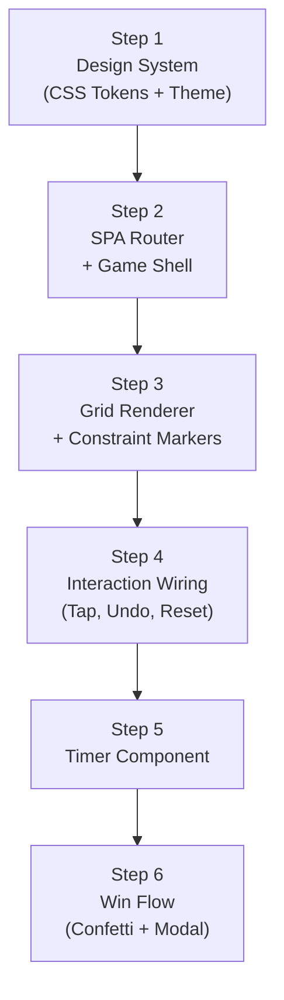

# Document 4: Phase 2 Micro-Plan — Tango UI & Renderer

> **Game:** Tango  
> **Phase:** 2 of 4 — UI & Renderer  
> **Depends On:** Phase 1 complete (logic engine, solver, generator all tested)  
> **Goal:** Build the complete visual game: grid, interactions, animations, timer, win flow  
> **Steps:** 6 sequential steps  
> **Testing:** Playwright E2E + visual inspection via browser  

---

## Step Map



---

## Step 1: Shared Design System

### Objective
Create the foundational CSS: design tokens, reset, dark theme, typography. This is shared across ALL games and the hub — built once, used everywhere.

### Files

| File | Responsibility |
|------|----------------|
| `src/styles/tokens.css` | CSS custom properties: colors, spacing, radii, shadows, animation durations |
| `src/styles/reset.css` | Modern CSS reset (box-sizing, margin, font smoothing) |
| `src/styles/global.css` | Base styles, dark theme application, typography, body defaults |
| `index.html` | Add Google Fonts link, meta tags, CSS imports |

### 1.1 — Design Tokens (`tokens.css`)

```css
:root {
  /* === Background === */
  --bg-primary:       #1B1F23;
  --bg-secondary:     #2D2D2D;
  --bg-surface:       #3A3A3A;
  --bg-surface-hover: #4A4A4A;
  --bg-surface-active:#525252;

  /* === Text === */
  --text-primary:     #FFFFFF;
  --text-secondary:   #B0B0B0;
  --text-muted:       #787878;

  /* === Accent === */
  --accent-blue:      #70B5F9;
  --accent-green:     #57C47A;
  --accent-red:       #E74C3C;
  --accent-orange:    #F5A623;
  --accent-red-bg:    rgba(231, 76, 60, 0.15);

  /* === Tango-Specific === */
  --sun-gold:         #FFD54F;
  --sun-gold-bg:      rgba(255, 213, 79, 0.15);
  --moon-purple:      #B39DDB;
  --moon-purple-bg:   rgba(179, 157, 219, 0.15);

  /* === Queens Palette (for later) === */
  --pastel-pink:      #F4A0B5;
  --pastel-purple:    #B39DDB;
  --pastel-green:     #81C784;
  --pastel-orange:    #FFB74D;
  --pastel-blue:      #64B5F6;
  --pastel-teal:      #4DD0E1;
  --pastel-yellow:    #FFF176;
  --pastel-coral:     #FF8A80;
  --pastel-indigo:    #9FA8DA;

  /* === Spacing === */
  --space-xs:         4px;
  --space-sm:         8px;
  --space-md:         16px;
  --space-lg:         24px;
  --space-xl:         32px;
  --space-2xl:        48px;

  /* === Border Radius === */
  --radius-sm:        4px;
  --radius-md:        8px;
  --radius-lg:        12px;
  --radius-xl:        16px;
  --radius-full:      9999px;

  /* === Shadows === */
  --shadow-sm:        0 1px 3px rgba(0, 0, 0, 0.3);
  --shadow-md:        0 4px 12px rgba(0, 0, 0, 0.4);
  --shadow-lg:        0 8px 24px rgba(0, 0, 0, 0.5);
  --shadow-glow-sun:  0 0 12px rgba(255, 213, 79, 0.4);
  --shadow-glow-moon: 0 0 12px rgba(179, 157, 219, 0.4);

  /* === Animation Durations === */
  --dur-fast:         100ms;
  --dur-normal:       200ms;
  --dur-slow:         400ms;
  --dur-confetti:     2000ms;

  /* === Grid === */
  --cell-size:        56px;
  --cell-gap:         2px;
  --cell-size-mobile: 48px;
  --grid-border:      2px solid rgba(255, 255, 255, 0.1);

  /* === Z-Index === */
  --z-grid:           1;
  --z-constraints:    2;
  --z-modal:          100;
  --z-confetti:       200;
}
```

### 1.2 — CSS Reset (`reset.css`)

```css
*, *::before, *::after {
  box-sizing: border-box;
  margin: 0;
  padding: 0;
}

html {
  -webkit-font-smoothing: antialiased;
  -moz-osx-font-smoothing: grayscale;
  text-size-adjust: 100%;
}

body {
  min-height: 100dvh;
  line-height: 1.5;
}

img, svg {
  display: block;
  max-width: 100%;
}

button {
  cursor: pointer;
  border: none;
  background: none;
  font: inherit;
  color: inherit;
}

input, textarea, select {
  font: inherit;
}
```

### 1.3 — Global Styles (`global.css`)

```css
@import url('https://fonts.googleapis.com/css2?family=Inter:wght@400;500;600;700&display=swap');

body {
  font-family: 'Inter', -apple-system, BlinkMacSystemFont, 'Segoe UI', sans-serif;
  background-color: var(--bg-primary);
  color: var(--text-primary);
  overflow-x: hidden;
}

#app {
  display: flex;
  flex-direction: column;
  align-items: center;
  min-height: 100dvh;
  padding: var(--space-md);
}

/* Utility: visually hidden for accessibility */
.sr-only {
  position: absolute;
  width: 1px; height: 1px;
  padding: 0; margin: -1px;
  overflow: hidden;
  clip: rect(0, 0, 0, 0);
  border: 0;
}
```

### 1.4 — Update `index.html`

```html
<!DOCTYPE html>
<html lang="en">
<head>
  <meta charset="UTF-8">
  <meta name="viewport" content="width=device-width, initial-scale=1.0">
  <meta name="description" content="Daily puzzle games — Tango, Queens, Mini Sudoku, Zip">
  <meta name="theme-color" content="#1B1F23">
  <title>LinkedIn Games</title>
  <link rel="stylesheet" href="/src/styles/tokens.css">
  <link rel="stylesheet" href="/src/styles/reset.css">
  <link rel="stylesheet" href="/src/styles/global.css">
</head>
<body>
  <div id="app"></div>
  <script type="module" src="/src/main.js"></script>
</body>
</html>
```

### Checkpoint 1

| Check | Pass Criteria |
|-------|---------------|
| `npm run dev` loads | Dark background (#1B1F23) fills viewport |
| Inter font loads | Text renders in Inter (check devtools Network tab) |
| Tokens accessible | `getComputedStyle(document.body).getPropertyValue('--bg-primary')` returns `#1B1F23` |
| No console errors | Clean console on page load |

---

## Step 2: SPA Router + Game Shell

### Objective
Build a minimal hash-based router and the shared "game shell" — the chrome surrounding every game (header with back button, title, timer placeholder, controls bar).

### Files

| File | Responsibility |
|------|----------------|
| `src/router.js` | Hash-based SPA router |
| `src/main.js` | Wire router, register game modules |
| `src/styles/game-shell.css` | Game shell header/controls styles |

### 2.1 — Router (`router.js`)

```js
/**
 * Minimal hash-based SPA router.
 * 
 * Usage:
 *   const router = createRouter('#app');
 *   router.register('/', hubModule);
 *   router.register('/tango', tangoModule);
 *   router.start();
 * 
 * Each module must export:
 *   mount(container: HTMLElement) → void
 *   unmount() → void
 */
```

**Key behaviors:**
- Listen to `hashchange` event
- On route change: call `currentModule.unmount()`, then `nextModule.mount(container)`
- Default route: `#/` → hub
- Unknown routes → redirect to `#/`
- Export `navigate(path)` helper for programmatic navigation

### 2.2 — Game Shell HTML Structure

Every game page wraps content in this shared shell:

```
┌──────────────────────────────────────┐
│  [← Back]        TANGO       00:00  │  ← .game-header
├──────────────────────────────────────┤
│                                      │
│         [ GAME GRID AREA ]           │  ← .game-board (game-specific)
│                                      │
├──────────────────────────────────────┤
│         [Undo]    [Reset]            │  ← .game-controls
└──────────────────────────────────────┘
```

### 2.3 — Game Shell CSS (`game-shell.css`)

```css
.game-page {
  display: flex;
  flex-direction: column;
  align-items: center;
  width: 100%;
  max-width: 480px;
  gap: var(--space-lg);
  padding-top: var(--space-md);
}

.game-header {
  display: flex;
  align-items: center;
  justify-content: space-between;
  width: 100%;
  padding: var(--space-sm) 0;
}

.game-header__back {
  /* Back arrow button */
  display: flex;
  align-items: center;
  gap: var(--space-xs);
  color: var(--accent-blue);
  font-size: 14px;
  font-weight: 500;
  padding: var(--space-sm) var(--space-md);
  border-radius: var(--radius-md);
  transition: background var(--dur-fast);
}
.game-header__back:hover {
  background: var(--bg-surface);
}

.game-header__title {
  font-size: 20px;
  font-weight: 700;
  letter-spacing: 0.5px;
  text-transform: uppercase;
}

.game-header__timer {
  font-family: 'JetBrains Mono', 'Courier New', monospace;
  font-size: 16px;
  font-weight: 500;
  color: var(--text-secondary);
  min-width: 60px;
  text-align: right;
}

.game-board {
  /* Filled by each game's renderer */
  display: flex;
  justify-content: center;
  align-items: center;
}

.game-controls {
  display: flex;
  gap: var(--space-md);
}

.game-controls__btn {
  padding: var(--space-sm) var(--space-lg);
  border-radius: var(--radius-md);
  background: var(--bg-surface);
  color: var(--text-primary);
  font-size: 14px;
  font-weight: 500;
  transition: background var(--dur-fast), transform var(--dur-fast);
}
.game-controls__btn:hover {
  background: var(--bg-surface-hover);
}
.game-controls__btn:active {
  transform: scale(0.96);
}
```

### 2.4 — Game Shell Builder (shared utility)

Create `src/shared/game-shell.js`:

```js
/**
 * Creates the game shell DOM and returns references to key containers.
 * 
 * @param {object} options
 * @param {string} options.title - Game name ("TANGO")
 * @param {function} options.onBack - Back button callback
 * @param {function} options.onUndo - Undo button callback
 * @param {function} options.onReset - Reset button callback
 * @returns {{ 
 *   shell: HTMLElement, 
 *   boardContainer: HTMLElement, 
 *   timerDisplay: HTMLElement 
 * }}
 */
export function createGameShell({ title, onBack, onUndo, onReset }) { ... }
```

### Checkpoint 2

| Check | Pass Criteria |
|-------|---------------|
| Navigate to `#/tango` | Game shell renders with "TANGO" title, back button, timer "00:00", undo/reset buttons |
| Back button | Clicking "← Back" navigates to `#/` (hub placeholder) |
| Router handles `#/` | Shows hub placeholder text |
| Unknown route `#/foo` | Redirects to `#/` |
| Responsive | Shell fits mobile viewport (max-width: 480px, centered) |
| No game grid yet | Board container is empty (placeholder) — grid comes in Step 3 |

---

## Step 3: Grid Renderer + Constraint Markers

### Objective
Build the 6×6 Tango grid DOM, render cells with symbols, and position constraint markers (= and ×) on cell borders.

### Files

| File | Responsibility |
|------|----------------|
| `src/games/tango/tango-renderer.js` | Grid DOM builder, cell rendering, constraint positioning |
| `src/styles/tango.css` | Tango-specific grid and cell styles |

### 3.1 — Grid DOM Structure

```html
<div class="tango-grid" role="grid" aria-label="Tango puzzle grid">
  <!-- Row 0 -->
  <div class="tango-cell" data-row="0" data-col="0" role="gridcell" tabindex="0">
    <span class="tango-cell__symbol">☀️</span>
  </div>
  <div class="tango-cell tango-cell--empty" data-row="0" data-col="1" role="gridcell" tabindex="0">
  </div>
  <!-- ... 36 cells total ... -->

  <!-- Constraint markers (positioned absolutely) -->
  <div class="tango-constraint tango-constraint--h" 
       data-r1="0" data-c1="2" data-r2="0" data-c2="3"
       style="top: Xpx; left: Ypx;">
    =
  </div>
  <div class="tango-constraint tango-constraint--v"
       data-r1="1" data-c1="4" data-r2="2" data-c2="4"  
       style="top: Xpx; left: Ypx;">
    ×
  </div>
</div>
```

### 3.2 — Grid CSS (`tango.css`)

```css
/* === Grid Container === */
.tango-grid {
  display: grid;
  grid-template-columns: repeat(6, var(--cell-size));
  grid-template-rows: repeat(6, var(--cell-size));
  gap: var(--cell-gap);
  position: relative;
  background: var(--bg-secondary);
  padding: var(--cell-gap);
  border-radius: var(--radius-lg);
  box-shadow: var(--shadow-md);
}

/* === Cells === */
.tango-cell {
  display: flex;
  align-items: center;
  justify-content: center;
  background: var(--bg-surface);
  border-radius: var(--radius-sm);
  cursor: pointer;
  user-select: none;
  transition: background var(--dur-fast), transform var(--dur-fast);
  position: relative;
}

.tango-cell:hover {
  background: var(--bg-surface-hover);
}

.tango-cell:active {
  transform: scale(0.92);
}

/* Pre-filled cells: non-interactive, visually distinct */
.tango-cell--locked {
  cursor: default;
  opacity: 0.9;
}
.tango-cell--locked:hover {
  background: var(--bg-surface); /* No hover change */
}
.tango-cell--locked:active {
  transform: none;
}

/* Sun cell */
.tango-cell--sun {
  background: var(--sun-gold-bg);
}
.tango-cell--sun .tango-cell__symbol {
  color: var(--sun-gold);
  text-shadow: var(--shadow-glow-sun);
}

/* Moon cell */
.tango-cell--moon {
  background: var(--moon-purple-bg);
}
.tango-cell--moon .tango-cell__symbol {
  color: var(--moon-purple);
  text-shadow: var(--shadow-glow-moon);
}

/* Symbol icon */
.tango-cell__symbol {
  font-size: 24px;
  line-height: 1;
  transition: opacity var(--dur-normal), transform var(--dur-normal);
}

/* === Constraint Markers === */
.tango-constraint {
  position: absolute;
  display: flex;
  align-items: center;
  justify-content: center;
  font-size: 12px;
  font-weight: 700;
  color: var(--text-secondary);
  pointer-events: none;
  z-index: var(--z-constraints);
}

/* Horizontal constraint (between two cells in the same row) */
.tango-constraint--h {
  width: calc(var(--cell-gap) + 16px);
  height: 20px;
  /* Positioned on the vertical border between two adjacent cells */
}

/* Vertical constraint (between two cells in the same column) */
.tango-constraint--v {
  width: 20px;
  height: calc(var(--cell-gap) + 16px);
  /* Positioned on the horizontal border between two stacked cells */
}

/* === Error Animations === */
@keyframes shake {
  0%, 100% { transform: translateX(0); }
  10% { transform: translateX(-6px); }
  30% { transform: translateX(6px); }
  50% { transform: translateX(-4px); }
  70% { transform: translateX(4px); }
  90% { transform: translateX(-2px); }
}

.tango-cell--shake {
  animation: shake var(--dur-slow) ease-in-out;
}

.tango-cell--error {
  background: var(--accent-red-bg) !important;
  transition: background var(--dur-slow);
}

/* === Symbol Appear Animation === */
@keyframes symbolAppear {
  from {
    opacity: 0;
    transform: scale(0.7);
  }
  to {
    opacity: 1;
    transform: scale(1);
  }
}

.tango-cell__symbol--entering {
  animation: symbolAppear var(--dur-normal) ease-out;
}

/* === Mobile Responsive === */
@media (max-width: 400px) {
  .tango-grid {
    grid-template-columns: repeat(6, var(--cell-size-mobile));
    grid-template-rows: repeat(6, var(--cell-size-mobile));
  }
  .tango-cell__symbol {
    font-size: 20px;
  }
}
```

### 3.3 — Constraint Marker Positioning Logic

Constraint markers are positioned absolutely within the grid container. The position is calculated based on the cell coordinates:

```js
/**
 * Calculate the CSS position for a constraint marker.
 * 
 * For horizontal constraint between (r, c) and (r, c+1):
 *   top  = r * (cellSize + gap) + cellSize/2 - markerHeight/2
 *   left = (c+1) * (cellSize + gap) - gap/2 - markerWidth/2
 * 
 * For vertical constraint between (r, c) and (r+1, c):
 *   top  = (r+1) * (cellSize + gap) - gap/2 - markerHeight/2
 *   left = c * (cellSize + gap) + cellSize/2 - markerWidth/2
 * 
 * Note: Add grid padding offset to both.
 */
```

### 3.4 — Renderer API

```js
// tango-renderer.js exports:

/**
 * Build the full grid DOM for a puzzle.
 * @param {object} puzzle - { puzzle: Board, constraints: Constraint[] }
 * @returns {HTMLElement} - The .tango-grid element
 */
export function renderGrid(puzzle) { ... }

/**
 * Update a single cell's visual state.
 * @param {HTMLElement} grid - The grid container
 * @param {number} row
 * @param {number} col
 * @param {string|null} symbol - 'sun', 'moon', or null
 * @param {object} options - { animate: boolean, locked: boolean }
 */
export function updateCell(grid, row, col, symbol, options = {}) { ... }

/**
 * Trigger error animation on a cell.
 */
export function shakeCell(grid, row, col) { ... }

/**
 * Highlight a row/column briefly to show a rule violation.
 */
export function flashLine(grid, type, index) { ... }
```

### 3.5 — Symbol Rendering

Instead of emoji (which render inconsistently across platforms), use **SVG icons** or **CSS-drawn symbols**:

**Sun symbol (CSS):**
```css
/* Circle with radiating lines — or a simple filled circle with glow */
.symbol-sun {
  width: 28px;
  height: 28px;
  border-radius: 50%;
  background: var(--sun-gold);
  box-shadow: var(--shadow-glow-sun);
}
```

**Moon symbol (CSS):**
```css
/* Crescent moon using box-shadow trick or SVG */
.symbol-moon {
  width: 24px;
  height: 24px;
  border-radius: 50%;
  background: transparent;
  box-shadow: 8px -2px 0 0 var(--moon-purple);
}
```

> [!NOTE]
> **Effort/similarity tradeoff:** CSS-drawn symbols are simple to implement, render perfectly cross-platform, and closely match LinkedIn's clean aesthetic. SVG would give more control but adds asset management. CSS approach is the right balance — medium effort, high similarity.

### Checkpoint 3

| Check | Pass Criteria |
|-------|---------------|
| Grid renders | 6×6 grid visible with dark cells on dark background |
| Symbols display | Sun (gold circle) and Moon (purple crescent) render in pre-filled cells |
| Constraint markers | "=" and "×" markers appear on correct cell borders |
| Marker positioning | Markers are centered on the border between their two cells (horizontal + vertical) |
| Locked cells | Pre-filled cells have `--locked` styling, don't show hover/active effects |
| Empty cells | Show hover effect and press animation |
| Responsive | Grid shrinks on mobile (< 400px) without breaking layout |
| Accessibility | Grid has `role="grid"`, cells have `role="gridcell"` and `tabindex` |

---

## Step 4: Interaction Wiring

### Objective
Wire up the full interaction model: tap cycle, validation feedback, undo/reset, and move history.

### Files

| File | Responsibility |
|------|----------------|
| `src/games/tango/tango.js` | Game controller — lifecycle, events, state management |
| `src/games/tango/tango-renderer.js` | (updated) — event listeners on cells |

### 4.1 — Game State Machine

```
States:
  LOADING   → loading puzzle (from storage or generator)
  PLAYING   → active gameplay
  COMPLETED → puzzle solved
  
Transitions:
  LOADING  → PLAYING    : puzzle loaded, grid rendered
  PLAYING  → PLAYING    : valid move made
  PLAYING  → PLAYING    : invalid move attempted (shake animation, no state change)
  PLAYING  → COMPLETED  : checkWin() returns true
  COMPLETED → LOADING   : "Play Again" (non-daily) or next day
```

### 4.2 — Tap Cycle Logic

```js
function handleCellTap(row, col) {
  if (state !== 'PLAYING') return;
  if (isLockedCell(row, col)) return; // Pre-filled, ignore

  const current = board[row][col];
  let next;

  // Cycle: null → sun → moon → null
  if (current === null)           next = SYMBOLS.SUN;
  else if (current === SYMBOLS.SUN)  next = SYMBOLS.MOON;
  else                               next = null;

  if (next === null) {
    // Clearing is always valid
    pushToHistory({ row, col, from: current, to: null });
    board[row][col] = null;
    updateCell(grid, row, col, null, { animate: true });
  } else {
    // Validate placement
    const check = isValidPlacement(board, row, col, next, constraints);
    if (check.valid) {
      pushToHistory({ row, col, from: current, to: next });
      board[row][col] = next;
      updateCell(grid, row, col, next, { animate: true });
      
      // Check for win
      if (checkWin(board, constraints)) {
        transitionTo('COMPLETED');
      }
    } else {
      // Invalid — shake + flash
      shakeCell(grid, row, col);
      // Optionally: skip to next valid, or just reject
    }
  }

  autoSave();
}
```

> [!IMPORTANT]
> **Design decision — reject vs. skip:**
> LinkedIn Tango **allows** placing any symbol and shows errors passively (no shake on placement). The board highlights conflicts. However, for our clone, we'll use **active rejection** (shake on invalid) because:
> 1. It teaches the rules faster for practice
> 2. It's more satisfying (immediate feedback)
> 3. It matches the "error shake" pattern from LinkedIn's other games
>
> If testing shows this feels wrong, we can switch to passive validation in polish (Phase 4).

### 4.3 — Move History (Undo Stack)

```js
const moveHistory = []; // Stack of { row, col, from, to }

function pushToHistory(move) {
  moveHistory.push(move);
}

function undo() {
  if (moveHistory.length === 0) return;
  const move = moveHistory.pop();
  board[move.row][move.col] = move.from;
  updateCell(grid, move.row, move.col, move.from, { animate: false });
  autoSave();
}

function reset() {
  // Restore to initial puzzle state (clear all user-placed symbols)
  for (let r = 0; r < SIZE; r++) {
    for (let c = 0; c < SIZE; c++) {
      if (!isLockedCell(r, c)) {
        board[r][c] = null;
        updateCell(grid, r, c, null, { animate: false });
      }
    }
  }
  moveHistory.length = 0;
  autoSave();
}
```

### 4.4 — Event Binding Strategy

```js
// Single event listener on grid container (event delegation)
grid.addEventListener('click', (e) => {
  const cell = e.target.closest('.tango-cell');
  if (!cell) return;
  
  const row = parseInt(cell.dataset.row);
  const col = parseInt(cell.dataset.col);
  handleCellTap(row, col);
});

// Keyboard support for accessibility
grid.addEventListener('keydown', (e) => {
  if (e.key === 'Enter' || e.key === ' ') {
    e.preventDefault();
    const cell = e.target.closest('.tango-cell');
    if (!cell) return;
    handleCellTap(parseInt(cell.dataset.row), parseInt(cell.dataset.col));
  }
});
```

### 4.5 — Auto-Save (debounced)

```js
// Save current state to localStorage after every move
// Debounced to avoid excessive writes on rapid tapping
function autoSave() {
  clearTimeout(saveTimeout);
  saveTimeout = setTimeout(() => {
    storage.save('lg_tango_daily', {
      date: todayStr(),
      board: board,
      constraints: constraints,
      puzzle: initialPuzzle, // The original (for reset)
      timer: timer.getElapsed(),
      moveHistory: moveHistory,
      completed: state === 'COMPLETED',
    });
  }, 300);
}
```

### Checkpoint 4

| Check | Pass Criteria |
|-------|---------------|
| Tap cycle works | empty → sun (gold) → moon (purple) → empty, with animation |
| Pre-filled locked | Tapping locked cells does nothing |
| Invalid rejection | Placing a 4th sun in a row triggers shake + red flash |
| Three-in-a-row rejection | Attempting 3 suns/moons in a row triggers shake |
| Constraint rejection | Violating = or × constraint triggers shake |
| Undo works | Undo button reverses the last move visually and in state |
| Multiple undo | Can undo all the way back to initial puzzle |
| Reset works | Reset clears all user symbols, keeps pre-fills |
| Event delegation | Single click listener on grid, not 36 individual listeners |
| Keyboard | Enter/Space on focused cell triggers tap cycle |
| Auto-save | After a move, `localStorage.lg_tango_daily` contains board state |

---

## Step 5: Timer Component

### Objective
Build the shared timer that starts on first move, displays mm:ss, and can be paused/resumed/saved.

### Files

| File | Responsibility |
|------|----------------|
| `src/shared/timer.js` | Shared timer module |

### 5.1 — Timer API

```js
/**
 * Create a game timer.
 * 
 * @param {HTMLElement} displayEl - Element to render "mm:ss" into
 * @param {number} initialSeconds - Resume from this elapsed time (default 0)
 * @returns {{
 *   start: () => void,
 *   stop: () => number,
 *   pause: () => void,
 *   resume: () => void,
 *   reset: () => void,
 *   getElapsed: () => number,
 *   isRunning: () => boolean,
 * }}
 */
export function createTimer(displayEl, initialSeconds = 0) { ... }
```

### 5.2 — Implementation Notes

- Use `setInterval` at 1000ms for display updates (not for timekeeping)
- Actual elapsed time tracked via `performance.now()` or `Date.now()` deltas — avoids drift
- Display format: `mm:ss` (e.g., "02:34")
- Timer does NOT auto-start on page load — starts on **first cell tap**
- If resuming from save: set `initialSeconds` and start immediately

### 5.3 — Timer Integration in Tango

```js
// In tango.js:
const timer = createTimer(
  shell.timerDisplay,
  savedState?.timer ?? 0
);

// Start on first move
let firstMove = true;
function handleCellTap(row, col) {
  if (firstMove) {
    timer.start();
    firstMove = false;
  }
  // ... rest of tap logic
}

// Stop on win
function transitionTo(newState) {
  if (newState === 'COMPLETED') {
    const elapsed = timer.stop();
    showResultsModal(elapsed);
  }
}
```

### Checkpoint 5

| Check | Pass Criteria |
|-------|---------------|
| Timer displays "00:00" initially | Before first move |
| Timer starts on first tap | Only starts counting after the first cell interaction |
| Timer ticks | Display updates every second (00:01, 00:02, ...) |
| Timer format | Always mm:ss with zero-padding (01:05, not 1:5) |
| Timer pauses | On page hidden (`visibilitychange`) or explicit pause |
| Timer resumes | On page visible again, resumes from correct elapsed |
| Timer saves | `getElapsed()` returns correct total seconds for save |
| Timer stops on win | Stops and returns final time on `checkWin()` |
| Timer resets | On puzzle reset, timer goes back to 00:00 |

---

## Step 6: Win Flow — Confetti + Results Modal

### Objective
Complete the victory experience: detect win → stop timer → play confetti → show results modal.

### Files

| File | Responsibility |
|------|----------------|
| `src/shared/confetti.js` | Canvas-based confetti particle system |
| `src/shared/modal.js` | Reusable results modal component |
| `src/styles/game-shell.css` | (updated) modal styles |

### 6.1 — Confetti System

**Architecture:** Full-screen `<canvas>` overlay, `pointer-events: none`, z-index above everything.

**Particle specification:**

| Property | Value |
|----------|-------|
| Count | 80–120 particles |
| Shapes | Small rectangles (8×4px) and squares (6×6px) |
| Colors | Random from game's palette (sun-gold, moon-purple, accent-green, accent-blue, pastel-pink) |
| Initial velocity | Upward burst: vy = -8 to -14, vx = -5 to +5 |
| Gravity | 0.15 per frame |
| Rotation | Random spin rate per particle |
| Opacity | Starts at 1.0, fades to 0 in last 500ms |
| Duration | 2000ms total |
| Frame rate | `requestAnimationFrame` (60fps) |

**API:**

```js
/**
 * Trigger a confetti burst.
 * @param {string[]} colors - Array of CSS color strings
 * @param {number} duration - Duration in ms (default 2000)
 */
export function fireConfetti(colors, duration = 2000) { ... }
```

**Lifecycle:**
1. Create `<canvas>` element, append to `<body>`
2. Set canvas size to `window.innerWidth × window.innerHeight`
3. Initialize particles with random properties
4. Run animation loop via `requestAnimationFrame`
5. After `duration` ms, stop loop and remove canvas

### 6.2 — Results Modal

```
┌──────────────────────────────────┐
│                                  │
│          🎉 Solved!              │
│                                  │
│     ┌──────────────────────┐     │
│     │  Time      02:34     │     │
│     │  Moves     28        │     │
│     │  Streak    🔥 5       │     │
│     └──────────────────────┘     │
│                                  │
│   [ New Puzzle ]   [ Hub →  ]    │
│                                  │
└──────────────────────────────────┘
       (dark backdrop overlay)
```

**CSS for modal:**

```css
.modal-backdrop {
  position: fixed;
  inset: 0;
  background: rgba(0, 0, 0, 0.6);
  display: flex;
  align-items: center;
  justify-content: center;
  z-index: var(--z-modal);
  opacity: 0;
  transition: opacity var(--dur-normal);
}
.modal-backdrop--visible {
  opacity: 1;
}

.modal-card {
  background: var(--bg-secondary);
  border-radius: var(--radius-xl);
  padding: var(--space-xl);
  min-width: 300px;
  max-width: 380px;
  box-shadow: var(--shadow-lg);
  text-align: center;
  transform: scale(0.9);
  transition: transform 300ms cubic-bezier(0.34, 1.56, 0.64, 1);
}
.modal-backdrop--visible .modal-card {
  transform: scale(1);
}

.modal-title {
  font-size: 24px;
  font-weight: 700;
  margin-bottom: var(--space-lg);
}

.modal-stats {
  display: flex;
  flex-direction: column;
  gap: var(--space-sm);
  background: var(--bg-surface);
  border-radius: var(--radius-md);
  padding: var(--space-md);
  margin-bottom: var(--space-lg);
}

.modal-stat {
  display: flex;
  justify-content: space-between;
  font-size: 16px;
}
.modal-stat__label {
  color: var(--text-secondary);
}
.modal-stat__value {
  font-weight: 600;
}

.modal-actions {
  display: flex;
  gap: var(--space-md);
  justify-content: center;
}

.modal-btn {
  padding: var(--space-sm) var(--space-xl);
  border-radius: var(--radius-full);
  font-weight: 600;
  font-size: 14px;
  transition: background var(--dur-fast), transform var(--dur-fast);
}
.modal-btn:active {
  transform: scale(0.96);
}

.modal-btn--primary {
  background: var(--accent-blue);
  color: #000;
}
.modal-btn--primary:hover {
  background: #8CC6FF;
}

.modal-btn--secondary {
  background: var(--bg-surface);
  color: var(--text-primary);
}
.modal-btn--secondary:hover {
  background: var(--bg-surface-hover);
}
```

### 6.3 — Modal API

```js
/**
 * Show a results modal.
 * @param {object} options
 * @param {string} options.title - "🎉 Solved!"
 * @param {Array<{label: string, value: string}>} options.stats
 * @param {Array<{label: string, variant: string, onClick: function}>} options.actions
 * @returns {{ close: () => void }}
 */
export function showModal({ title, stats, actions }) { ... }
```

### 6.4 — Win Sequence (in `tango.js`)

```js
function onWin() {
  state = 'COMPLETED';
  const elapsed = timer.stop();
  
  // 1. Update streak
  const streak = updateStreak('tango');
  
  // 2. Fire confetti (Tango colors)
  fireConfetti([
    'var(--sun-gold)',     // won't work in canvas — use actual hex
    '#FFD54F', '#B39DDB', '#57C47A', '#70B5F9', '#F4A0B5'
  ]);
  
  // 3. Show modal after short delay (let confetti settle)
  setTimeout(() => {
    showModal({
      title: '🎉 Solved!',
      stats: [
        { label: 'Time', value: formatTime(elapsed) },
        { label: 'Moves', value: String(moveHistory.length) },
        { label: 'Streak', value: `🔥 ${streak.current}` },
      ],
      actions: [
        { label: 'New Puzzle', variant: 'secondary', onClick: () => loadNewPuzzle() },
        { label: 'Hub →', variant: 'primary', onClick: () => navigate('/') },
      ],
    });
  }, 600);
  
  // 4. Save completion
  autoSave();
}
```

### Checkpoint 6 — PHASE 2 COMPLETE

| Check | Pass Criteria |
|-------|---------------|
| Win triggers correctly | Solving the puzzle (all cells valid + full) triggers win flow |
| Confetti plays | Canvas overlay appears with 80+ colored particles falling with gravity |
| Confetti cleans up | Canvas is removed from DOM after 2 seconds |
| Modal appears | Results modal slides in after ~600ms with correct stats |
| Modal backdrop | Clicking outside modal doesn't close it (prevent accidental dismissal) |
| "New Puzzle" button | Generates and loads a fresh (non-daily) puzzle |
| "Hub →" button | Closes modal and navigates to `#/` |
| Modal animation | Scale 0.9→1.0 with overshoot easing on open |
| Streak displays | Correct streak number in modal |
| **Full playthrough** | Start game → place symbols → solve → confetti → modal → navigate works end-to-end |

---

## Phase 2 Complete Deliverables

After completing all 6 steps, Tango is **fully playable** (but without daily/save integration — that's Phase 3):

| Component | Status |
|-----------|--------|
| Dark theme design system | ✅ Shared across all future games |
| SPA router | ✅ Navigates between hub and Tango |
| 6×6 grid with symbols | ✅ Sun/Moon render with CSS |
| Constraint markers | ✅ Positioned on cell borders |
| Tap cycle | ✅ empty → sun → moon → empty |
| Validation feedback | ✅ Shake + flash on invalid |
| Undo / Reset | ✅ Full move history |
| Timer | ✅ Starts on first move, stops on win |
| Confetti | ✅ Canvas particle system |
| Results modal | ✅ Time, moves, streak display |
| Game shell | ✅ Header, controls, responsive layout |
| E2E playthrough | ✅ Verified via Playwright |

### What Remains (Phase 3 & 4)
- Daily seeded puzzle generation + JSON bank
- localStorage save/resume across sessions
- Streak persistence
- Hub page with game cards
- Final polish pass
- PWA manifest & service worker

---

> [!TIP]
> **Commit strategy for Phase 2:**
> 1. `feat: design system — tokens, reset, dark theme`
> 2. `feat: SPA router + game shell`
> 3. `feat(tango): grid renderer + constraint markers`
> 4. `feat(tango): interaction wiring — tap, undo, reset`
> 5. `feat: shared timer component`
> 6. `feat: confetti + results modal — win flow complete`
