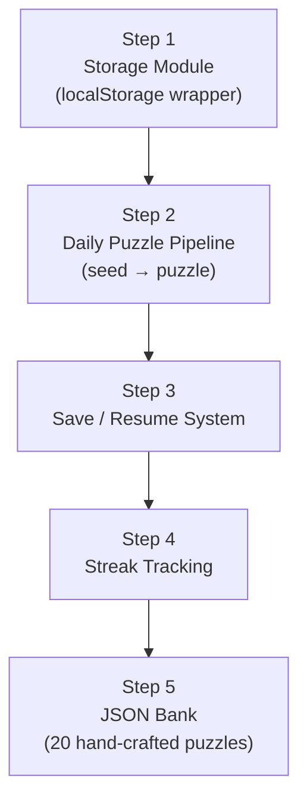
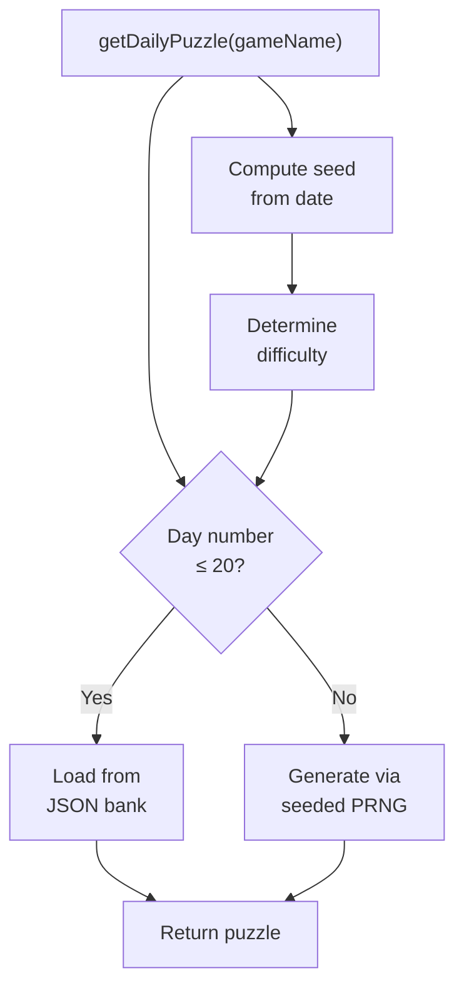
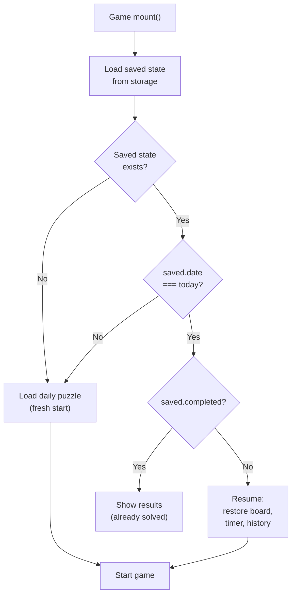

# Document 5: Phase 3 Micro-Plan — Tango Daily Integration

> **Game:** Tango  
> **Phase:** 3 of 4 — Daily Integration  
> **Depends On:** Phase 1 (logic engine) + Phase 2 (UI/renderer) complete  
> **Goal:** Wire game into the daily puzzle system: seeded generation, JSON bank, save/load, streaks  
> **Steps:** 5 sequential steps  
> **Testing:** Vitest (storage, daily logic) + Playwright (save/resume flows)  

---

## Step Map



---

## Step 1: Shared Storage Module

### Objective
Build a reusable localStorage wrapper that all 4 games will share. Handles JSON serialization, namespacing, and type safety.

### File: `src/shared/storage.js`

### API Design

```js
/**
 * Namespaced localStorage wrapper.
 * All keys are prefixed with "lg_" (LinkedIn Games).
 * 
 * Storage schema:
 *   lg_tango_daily   → { date, board, constraints, puzzle, timer, moveHistory, completed }
 *   lg_tango_streak  → { current, best, lastPlayDate, freezeAvailable }
 *   lg_queens_daily  → { ... }
 *   lg_queens_streak → { ... }
 *   lg_settings      → { theme, soundEnabled }
 */

const PREFIX = 'lg_';

/**
 * Save a value to localStorage.
 * @param {string} key - Key name (will be prefixed)
 * @param {any} value - Will be JSON.stringify'd
 */
export function save(key, value) {
  try {
    localStorage.setItem(PREFIX + key, JSON.stringify(value));
  } catch (e) {
    console.warn(`Storage save failed for ${key}:`, e);
  }
}

/**
 * Load a value from localStorage.
 * @param {string} key - Key name (will be prefixed)
 * @param {any} fallback - Default value if key doesn't exist or parse fails
 * @returns {any} - Parsed value or fallback
 */
export function load(key, fallback = null) {
  try {
    const raw = localStorage.getItem(PREFIX + key);
    if (raw === null) return fallback;
    return JSON.parse(raw);
  } catch (e) {
    console.warn(`Storage load failed for ${key}:`, e);
    return fallback;
  }
}

/**
 * Remove a value from localStorage.
 * @param {string} key - Key name (will be prefixed)
 */
export function remove(key) {
  localStorage.removeItem(PREFIX + key);
}

/**
 * Clear all LinkedIn Games data from localStorage.
 * Useful for debugging / factory reset.
 */
export function clearAll() {
  const keys = [];
  for (let i = 0; i < localStorage.length; i++) {
    const k = localStorage.key(i);
    if (k.startsWith(PREFIX)) keys.push(k);
  }
  keys.forEach(k => localStorage.removeItem(k));
}

/**
 * Get today's date string in YYYY-MM-DD format (local timezone).
 */
export function todayStr() {
  const d = new Date();
  return d.getFullYear() + '-' +
    String(d.getMonth() + 1).padStart(2, '0') + '-' +
    String(d.getDate()).padStart(2, '0');
}

/**
 * Get yesterday's date string in YYYY-MM-DD format.
 */
export function yesterdayStr() {
  const d = new Date();
  d.setDate(d.getDate() - 1);
  return d.getFullYear() + '-' +
    String(d.getMonth() + 1).padStart(2, '0') + '-' +
    String(d.getDate()).padStart(2, '0');
}
```

### Storage Schemas (Type Definitions)

```js
/**
 * @typedef {Object} DailyState
 * @property {string}       date         - "YYYY-MM-DD"
 * @property {Array<Array>}  board        - Current board state (with user moves)
 * @property {Array<Array>}  puzzle       - Original puzzle (for reset)
 * @property {Array}         constraints  - Constraint list
 * @property {Array<Array>}  solution     - The solution (for reference)
 * @property {number}        timer        - Elapsed seconds
 * @property {Array}         moveHistory  - Move stack for undo
 * @property {boolean}       completed    - Whether puzzle is solved
 * @property {string}        difficulty   - 'easy'|'medium'|'hard'
 */

/**
 * @typedef {Object} StreakState
 * @property {number}  current        - Current consecutive days
 * @property {number}  best           - All-time best streak
 * @property {string}  lastPlayDate   - "YYYY-MM-DD" of last completion
 * @property {boolean} freezeAvailable - Manual streak freeze toggle
 */
```

### Test File: `tests/shared/storage.test.js`

```
Tests to write:

1. save() + load() roundtrip:
   → save('test', { a: 1 }) then load('test') returns { a: 1 }

2. load() with missing key:
   → Returns fallback value (default null)

3. load() with custom fallback:
   → load('missing', { default: true }) returns { default: true }

4. remove():
   → save('x', 1), remove('x'), load('x') returns null

5. clearAll():
   → Saves multiple keys, clearAll(), all return null
   → Non-prefixed keys are NOT removed

6. Prefix isolation:
   → save('foo', 1) stores as 'lg_foo' in localStorage

7. todayStr():
   → Returns string matching /^\d{4}-\d{2}-\d{2}$/ pattern

8. yesterdayStr():
   → Returns a date exactly 1 day before todayStr()

9. Error handling:
   → save() with circular reference doesn't crash (logs warning)
   → load() with corrupted JSON returns fallback
```

> [!NOTE]
> **Vitest + localStorage:** Vitest runs in a Node-like environment by default. Use `vitest` with `environment: 'jsdom'` in config to get `localStorage` support, or mock it. Update `vite.config.js`:
> ```js
> test: {
>   environment: 'jsdom',
>   include: ['tests/**/*.test.js'],
> }
> ```

### Checkpoint 1

| Check | Pass Criteria |
|-------|---------------|
| All storage tests green | Roundtrip, fallback, remove, clearAll, date helpers |
| Prefix isolation | Only `lg_`-prefixed keys are touched |
| Error resilience | Corrupted data returns fallback, doesn't crash |
| `jsdom` environment | Vitest uses jsdom for localStorage access |

---

## Step 2: Daily Puzzle Pipeline

### Objective
Build the orchestrator that determines which puzzle to serve today: JSON bank (days 1–20) or algorithmic generation (day 21+), with seeded difficulty.

### File: `src/games/tango/tango-daily.js`

### Flow Diagram



### Implementation

```js
import { createRNG, dateSeed } from '../../shared/rng.js';
import { generatePuzzle } from './tango-generator.js';
import { load } from '../../shared/storage.js';
import { todayStr } from '../../shared/storage.js';

// Epoch: the date we started counting from (day 1 of the game)
const EPOCH = '2026-04-20'; // Configurable launch date

/**
 * Calculate which "day number" today is (1-indexed from EPOCH).
 * @param {string} dateStr - "YYYY-MM-DD"
 * @returns {number} - Day number (1, 2, 3, ...)
 */
export function getDayNumber(dateStr) {
  const epoch = new Date(EPOCH + 'T00:00:00');
  const current = new Date(dateStr + 'T00:00:00');
  const diffMs = current - epoch;
  return Math.floor(diffMs / (1000 * 60 * 60 * 24)) + 1;
}

/**
 * Determine today's difficulty based on the date seed.
 * @param {string} dateStr
 * @returns {'easy'|'medium'|'hard'}
 */
export function getDailyDifficulty(dateStr) {
  const seed = dateSeed(dateStr, 'tango_difficulty');
  const rng = createRNG(seed);
  const roll = Math.floor(rng() * 3);
  return ['easy', 'medium', 'hard'][roll];
}

/**
 * Load a puzzle from the JSON bank.
 * @param {number} dayNumber - 1-indexed day
 * @returns {Promise<object>} - Puzzle object
 */
async function loadFromBank(dayNumber) {
  const response = await fetch('/data/tango-levels.json');
  const levels = await response.json();
  
  // dayNumber is 1-indexed, array is 0-indexed
  const index = (dayNumber - 1) % levels.length;
  return levels[index];
}

/**
 * Generate a puzzle algorithmically using seeded PRNG.
 * @param {string} dateStr
 * @param {string} difficulty
 * @returns {object} - Puzzle object
 */
function generateFromSeed(dateStr, difficulty) {
  const seed = dateSeed(dateStr, 'tango');
  const rng = createRNG(seed);
  return generatePuzzle(difficulty, rng);
}

/**
 * Master orchestrator: get today's puzzle.
 * 
 * @param {string} [dateStr] - Override date (default: today)
 * @returns {Promise<{
 *   puzzle: Array, constraints: Array, solution: Array,
 *   difficulty: string, dayNumber: number, source: string
 * }>}
 */
export async function getDailyPuzzle(dateStr = todayStr()) {
  const dayNumber = getDayNumber(dateStr);
  const difficulty = getDailyDifficulty(dateStr);
  
  let result;
  let source;
  
  if (dayNumber >= 1 && dayNumber <= 20) {
    result = await loadFromBank(dayNumber);
    source = 'bank';
  } else {
    result = generateFromSeed(dateStr, difficulty);
    source = 'generated';
  }
  
  return {
    ...result,
    difficulty,
    dayNumber,
    source,
  };
}

/**
 * Generate a non-daily "practice" puzzle (unlimited play).
 * Uses Math.random() — not seeded, not saved as daily.
 * 
 * @param {'easy'|'medium'|'hard'} difficulty
 * @returns {object} - Puzzle object
 */
export function getPracticePuzzle(difficulty = 'medium') {
  const seed = Math.floor(Math.random() * 2147483647);
  const rng = createRNG(seed);
  return generatePuzzle(difficulty, rng);
}
```

### Edge Cases

| Case | Handling |
|------|----------|
| Date before EPOCH | `getDayNumber` returns ≤ 0 → treat as day 1 |
| JSON bank fetch fails | Fall back to algorithmic generation with a warning |
| Same day, same puzzle | Guaranteed by deterministic seed from date string |
| Timezone issues | `todayStr()` uses local timezone — player always gets "their" today |

### Test File: `tests/tango/tango-daily.test.js`

```
Tests to write:

1. getDayNumber():
   → EPOCH date returns 1
   → EPOCH + 1 day returns 2
   → EPOCH + 19 days returns 20
   → EPOCH + 20 days returns 21

2. getDailyDifficulty():
   → Same date always returns same difficulty
   → Different dates can return different difficulties
   → Only returns 'easy', 'medium', or 'hard'

3. getDailyPuzzle():
   → Day 1–20: source === 'bank'
   → Day 21+: source === 'generated'
   → Same date always returns same puzzle (deterministic)
   → Different dates return different puzzles
   → Returned puzzle has valid structure { puzzle, constraints, solution, difficulty }

4. getPracticePuzzle():
   → Returns a valid puzzle
   → Two calls return different puzzles (non-deterministic)

5. Determinism regression:
   → getDailyPuzzle('2026-04-25') always returns EXACT same board
     (snapshot test — save expected output and compare)
```

### Checkpoint 2

| Check | Pass Criteria |
|-------|---------------|
| Daily pipeline tests green | Day number, difficulty, source routing all correct |
| Determinism | Same date → same everything, 100% of the time |
| JSON bank fallback | If bank is missing, gracefully falls back to generator |
| Practice mode works | Non-daily puzzles generate without date dependency |

---

## Step 3: Save / Resume System

### Objective
Wire auto-save into the game controller so progress persists across page refreshes, and implement the resume-vs-reset decision logic on game load.

### File: `src/games/tango/tango.js` (updated)

### Load Decision Flow



### Implementation

```js
// In tango.js — mount() function:

async function mount(container) {
  const saved = storage.load('tango_daily');
  const today = storage.todayStr();
  
  if (saved && saved.date === today) {
    if (saved.completed) {
      // Already solved today — show completion state
      renderCompletedState(container, saved);
      return;
    } else {
      // Resume in-progress game
      board = saved.board;
      constraints = saved.constraints;
      initialPuzzle = saved.puzzle;
      solution = saved.solution;
      difficulty = saved.difficulty;
      moveHistory = saved.moveHistory || [];
      
      // Render grid with current state
      renderGame(container);
      
      // Resume timer from saved elapsed
      timer = createTimer(shell.timerDisplay, saved.timer);
      timer.start(); // Start immediately on resume
      
      state = 'PLAYING';
      return;
    }
  }
  
  // New day — generate fresh puzzle
  const dailyPuzzle = await getDailyPuzzle(today);
  board = dailyPuzzle.puzzle.map(r => [...r]); // Working copy
  constraints = dailyPuzzle.constraints;
  initialPuzzle = dailyPuzzle.puzzle;          // Original for reset
  solution = dailyPuzzle.solution;
  difficulty = dailyPuzzle.difficulty;
  moveHistory = [];
  
  renderGame(container);
  timer = createTimer(shell.timerDisplay, 0);
  // Timer starts on first move (handled in handleCellTap)
  
  state = 'PLAYING';
}
```

### Auto-Save Implementation

```js
let saveTimeout = null;

function autoSave() {
  clearTimeout(saveTimeout);
  saveTimeout = setTimeout(() => {
    storage.save('tango_daily', {
      date: storage.todayStr(),
      board: board,
      puzzle: initialPuzzle,
      constraints: constraints,
      solution: solution,
      difficulty: difficulty,
      timer: timer.getElapsed(),
      moveHistory: moveHistory,
      completed: state === 'COMPLETED',
    });
  }, 300); // 300ms debounce
}

// Call autoSave() after every:
// - Cell tap (valid or clearing)
// - Undo
// - Reset
// - Win (with completed: true)
```

### Completed State View

When revisiting after solving today's puzzle:

```
┌──────────────────────────────────┐
│  ← Back      TANGO       ✓      │
├──────────────────────────────────┤
│                                  │
│     [Completed grid shown        │
│      with all symbols filled,    │
│      cells non-interactive]      │
│                                  │
├──────────────────────────────────┤
│     Time:    02:34               │
│     Moves:   28                  │
│     Streak:  🔥 5                │
│                                  │
│     [Practice Mode]              │
│     (play a non-daily puzzle)    │
└──────────────────────────────────┘
```

### Edge Cases

| Case | Handling |
|------|----------|
| User clears localStorage manually | Treated as new day — fresh puzzle generated |
| Corrupted save data | `storage.load()` returns fallback → fresh puzzle |
| Page refresh mid-game | Resume from last auto-save (≤300ms stale) |
| Midnight rollover while playing | Save is tied to date string — next load detects new date and generates new puzzle. In-progress state for "yesterday" is lost (acceptable for daily game) |
| `visibilitychange` (tab hidden) | Pause timer, but keep state. Resume on visible. |

### Test File: `tests/tango/tango-save.test.js`

```
Tests to write:

1. Fresh start (no saved state):
   → mount() loads daily puzzle, state === 'PLAYING'

2. Resume (saved state, same date, not completed):
   → mount() restores board, timer, moveHistory
   → Board matches saved state exactly
   → Timer starts from saved elapsed time

3. Already completed (saved state, same date, completed):
   → mount() shows completed view, grid non-interactive

4. New day (saved state, different date):
   → mount() ignores old save, loads new daily puzzle
   → Old save is overwritten

5. Auto-save triggers:
   → After cell tap, storage contains updated board
   → After undo, storage reflects undone state
   → After reset, storage has cleared board

6. Debounce:
   → Rapid taps only trigger one save (last state wins)

7. Corrupted data recovery:
   → Manually set garbage in localStorage → mount() recovers gracefully
```

### Checkpoint 3

| Check | Pass Criteria |
|-------|---------------|
| Fresh start | First visit → loads daily puzzle, timer at 00:00 |
| Resume works | Refresh page mid-game → board, timer, history all restored |
| Completed blocks replay | After solving, revisiting shows completed view |
| New day resets | Change date → new puzzle loads, old progress gone |
| Auto-save fires | `localStorage.lg_tango_daily` updates after moves |
| Timer resumes | Saved timer value carries over across refreshes |
| Practice mode | "New Puzzle" generates non-daily puzzle (no save conflict) |

---

## Step 4: Streak Tracking

### Objective
Implement the streak system: increment on consecutive-day completions, reset on gaps, track best-ever, and provide a simple manual freeze.

### File: `src/shared/streak.js`

### Streak Logic

```js
import { save, load, todayStr, yesterdayStr } from './storage.js';

/**
 * @typedef {Object} StreakData
 * @property {number}  current       - Current consecutive days
 * @property {number}  best          - All-time best streak
 * @property {string}  lastPlayDate  - "YYYY-MM-DD" of last daily completion
 * @property {boolean} freezeAvailable - Whether a manual freeze is active
 */

const DEFAULT_STREAK = {
  current: 0,
  best: 0,
  lastPlayDate: null,
  freezeAvailable: false,
};

/**
 * Get streak data for a game.
 * @param {string} gameName - e.g. 'tango'
 * @returns {StreakData}
 */
export function getStreak(gameName) {
  return load(`${gameName}_streak`, { ...DEFAULT_STREAK });
}

/**
 * Update streak after completing today's puzzle.
 * Call this ONCE per daily completion.
 * 
 * @param {string} gameName
 * @returns {StreakData} - Updated streak
 */
export function completeDaily(gameName) {
  const streak = getStreak(gameName);
  const today = todayStr();
  const yesterday = yesterdayStr();
  
  // Already counted today — no double-counting
  if (streak.lastPlayDate === today) {
    return streak;
  }
  
  if (streak.lastPlayDate === yesterday) {
    // Consecutive day — increment
    streak.current += 1;
  } else if (streak.lastPlayDate === null) {
    // First ever play
    streak.current = 1;
  } else {
    // Streak broken — check for freeze
    if (streak.freezeAvailable) {
      // Use the freeze: maintain streak
      streak.current += 1;
      streak.freezeAvailable = false;
    } else {
      // No freeze — reset
      streak.current = 1;
    }
  }
  
  // Update best
  streak.best = Math.max(streak.best, streak.current);
  streak.lastPlayDate = today;
  
  save(`${gameName}_streak`, streak);
  return streak;
}

/**
 * Toggle streak freeze on/off.
 * @param {string} gameName
 * @param {boolean} enabled
 */
export function setStreakFreeze(gameName, enabled) {
  const streak = getStreak(gameName);
  streak.freezeAvailable = enabled;
  save(`${gameName}_streak`, streak);
}

/**
 * Check if the daily puzzle has been completed today.
 * @param {string} gameName
 * @returns {boolean}
 */
export function isCompletedToday(gameName) {
  const saved = load(`${gameName}_daily`);
  return saved?.date === todayStr() && saved?.completed === true;
}
```

### Streak Display Integration

Update the results modal (from Phase 2) to use real streak data:

```js
// In tango.js — onWin():
import { completeDaily } from '../../shared/streak.js';

function onWin() {
  state = 'COMPLETED';
  const elapsed = timer.stop();
  
  // Update streak
  const streak = completeDaily('tango');
  
  // Fire confetti
  fireConfetti(['#FFD54F', '#B39DDB', '#57C47A', '#70B5F9', '#F4A0B5']);
  
  // Show modal with real data
  setTimeout(() => {
    showModal({
      title: '🎉 Solved!',
      stats: [
        { label: 'Time', value: formatTime(elapsed) },
        { label: 'Moves', value: String(moveHistory.length) },
        { label: 'Streak', value: `🔥 ${streak.current}` },
        { label: 'Best', value: `⭐ ${streak.best}` },
      ],
      actions: [
        { label: 'New Puzzle', variant: 'secondary', onClick: () => loadPracticePuzzle() },
        { label: 'Hub →', variant: 'primary', onClick: () => navigate('/') },
      ],
    });
  }, 600);
  
  autoSave();
}
```

### Test File: `tests/shared/streak.test.js`

```
Tests to write:

1. First completion ever:
   → current = 1, best = 1, lastPlayDate = today

2. Consecutive day completion:
   → Set lastPlayDate = yesterday, current = 3
   → completeDaily() → current = 4, best = max(old_best, 4)

3. Streak broken (gap > 1 day):
   → Set lastPlayDate = 3 days ago, current = 10
   → completeDaily() → current = 1 (reset)

4. Streak freeze saves streak:
   → Set lastPlayDate = 3 days ago, current = 10, freezeAvailable = true
   → completeDaily() → current = 11, freezeAvailable = false

5. No double-counting:
   → Call completeDaily() twice on same day
   → current only increments once

6. Best streak tracking:
   → Build up streak to 5, break it, build to 3
   → best = 5, current = 3

7. isCompletedToday():
   → No save → false
   → Save with different date → false
   → Save with today + completed: true → true
   → Save with today + completed: false → false

8. setStreakFreeze():
   → Toggle on → freezeAvailable = true in storage
   → Toggle off → freezeAvailable = false
```

### Checkpoint 4

| Check | Pass Criteria |
|-------|---------------|
| All streak tests green | Increment, reset, freeze, double-count protection |
| Modal shows real streak | After winning, modal displays correct current + best |
| Streak persists | Close browser, reopen → streak data survives |
| Freeze works | Enable freeze, skip a day, next completion maintains streak |
| No double-count | Refreshing after win doesn't re-increment streak |

---

## Step 5: JSON Bank — 20 Hand-Crafted Puzzles

### Objective
Create the first 20 Tango puzzles as a JSON file. These are guaranteed-quality, hand-verified puzzles for the first 20 days.

### File: `public/data/tango-levels.json`

### JSON Format

```json
[
  {
    "id": 1,
    "difficulty": "easy",
    "puzzle": [
      ["sun", null, "sun", null, "moon", null],
      [null, "moon", null, null, null, "sun"],
      [null, null, null, null, null, null],
      ["moon", null, null, "sun", null, null],
      [null, null, "sun", null, null, "moon"],
      [null, "sun", null, null, "moon", null]
    ],
    "constraints": [
      { "r1": 0, "c1": 2, "r2": 0, "c2": 3, "type": "same" },
      { "r1": 2, "c1": 1, "r2": 2, "c2": 2, "type": "different" },
      { "r1": 4, "c1": 0, "r2": 5, "c2": 0, "type": "same" }
    ],
    "solution": [
      ["sun", "moon", "sun", "sun", "moon", "moon"],
      ["moon", "moon", "sun", "moon", "sun", "sun"],
      ["sun", "sun", "moon", "moon", "sun", "moon"],
      ["moon", "sun", "moon", "sun", "moon", "sun"],
      ["sun", "moon", "sun", "moon", "sun", "moon"],
      ["moon", "sun", "moon", "sun", "moon", "sun"]
    ]
  },
  // ... 19 more puzzles
]
```

### Puzzle Distribution

| Difficulty | Count | Puzzle IDs |
|------------|-------|------------|
| **Easy** | 7 | 1, 2, 5, 8, 11, 14, 17 |
| **Medium** | 7 | 3, 6, 9, 12, 15, 18, 20 |
| **Hard** | 6 | 4, 7, 10, 13, 16, 19 |

### Authoring Strategy

Rather than hand-solving 20 puzzles from scratch, use the **generator** to produce them and then **curate**:

```js
// Authoring script (run once, save output):
// File: scripts/generate-bank.js

import { createRNG } from '../src/shared/rng.js';
import { generatePuzzle } from '../src/games/tango/tango-generator.js';
import { hasUniqueSolution } from '../src/games/tango/tango-solver.js';

const bank = [];
const difficulties = ['easy', 'easy', 'medium', 'hard', 'easy', 'medium', 'hard',
                       'easy', 'medium', 'hard', 'easy', 'medium', 'hard',
                       'easy', 'medium', 'hard', 'easy', 'medium', 'hard', 'medium'];

for (let i = 0; i < 20; i++) {
  const seed = 1000 + i; // Deterministic seeds for reproducibility
  const rng = createRNG(seed);
  const puzzle = generatePuzzle(difficulties[i], rng);
  
  // Double-verify unique solvability
  if (!hasUniqueSolution(puzzle.puzzle, puzzle.constraints)) {
    throw new Error(`Puzzle ${i + 1} is NOT uniquely solvable!`);
  }
  
  bank.push({
    id: i + 1,
    difficulty: difficulties[i],
    puzzle: puzzle.puzzle,
    constraints: puzzle.constraints,
    solution: puzzle.solution,
  });
}

// Output as JSON
console.log(JSON.stringify(bank, null, 2));
```

### Validation Script

```js
// scripts/validate-bank.js
// Run: node scripts/validate-bank.js

import levels from '../public/data/tango-levels.json';
import { hasUniqueSolution } from '../src/games/tango/tango-solver.js';
import { checkWin } from '../src/games/tango/tango-logic.js';

let allValid = true;
for (const level of levels) {
  // Check solution is valid
  if (!checkWin(level.solution, level.constraints)) {
    console.error(`Level ${level.id}: Solution is INVALID`);
    allValid = false;
  }
  
  // Check puzzle has unique solution
  if (!hasUniqueSolution(level.puzzle, level.constraints)) {
    console.error(`Level ${level.id}: NOT uniquely solvable`);
    allValid = false;
  }
  
  // Check puzzle matches solution (pre-filled cells are consistent)
  for (let r = 0; r < 6; r++) {
    for (let c = 0; c < 6; c++) {
      if (level.puzzle[r][c] !== null && level.puzzle[r][c] !== level.solution[r][c]) {
        console.error(`Level ${level.id}: Pre-fill mismatch at (${r},${c})`);
        allValid = false;
      }
    }
  }
  
  console.log(`Level ${level.id} (${level.difficulty}): ✓`);
}

console.log(allValid ? '\n✅ All 20 levels valid!' : '\n❌ Validation failed');
```

### Test File: `tests/tango/tango-bank.test.js`

```
Tests to write:

1. Bank has exactly 20 puzzles:
   → levels.length === 20

2. All IDs are unique:
   → Set of IDs has size 20

3. Every puzzle has required fields:
   → { id, difficulty, puzzle, constraints, solution }

4. Difficulty distribution:
   → At least 5 easy, 5 medium, 5 hard

5. Every puzzle is 6×6:
   → puzzle.length === 6, puzzle[i].length === 6

6. Every solution is valid:
   → checkWin(solution, constraints) === true for all 20

7. Every puzzle has unique solution:
   → hasUniqueSolution(puzzle, constraints) === true for all 20

8. Pre-fills are consistent with solution:
   → For every non-null cell in puzzle, it matches solution

9. Puzzle loads via fetch:
   → fetch('/data/tango-levels.json') returns valid array
```

### Checkpoint 5 — PHASE 3 COMPLETE

| Check | Pass Criteria |
|-------|---------------|
| All Phase 3 tests green | Storage, daily pipeline, save/resume, streak, bank validation |
| 20 puzzles in bank | All validated for unique solvability |
| Full daily flow | Open app → load today's puzzle → play → save → refresh → resume → solve → streak updates |
| Day rollover | Changing date → new puzzle, old progress replaced |
| Streak works end-to-end | Play consecutive days → streak increments in modal |
| Practice mode | "New Puzzle" generates fresh unlimited puzzle |
| **Total test count across Phase 1–3** | **≥ 80 tests** |

---

## Phase 3 Complete Deliverables

| Component | Status |
|-----------|--------|
| localStorage wrapper | ✅ Shared, prefixed, error-resilient |
| Daily puzzle pipeline | ✅ Seeded from date, routes bank vs. generator |
| Save/resume | ✅ Auto-saves every move, resumes on reload |
| Completed state | ✅ Can't replay solved puzzle, shows results |
| Streak system | ✅ Increments, resets, freezes, tracks best |
| JSON bank (20 puzzles) | ✅ Hand-curated, all validated unique-solution |
| Practice mode | ✅ Unlimited non-daily puzzles |
| Day-number system | ✅ EPOCH-based counting for bank indexing |

### What Remains (Phase 4 — Polish)
- Hub page with all game cards + streak badges
- Final responsive polish
- Accessibility pass (ARIA, keyboard navigation)
- Performance audit (60fps animations)
- PWA manifest + service worker
- E2E full-flow Playwright tests
- User feedback round ("does this feel like LinkedIn?")

---

> [!TIP]
> **Commit strategy for Phase 3:**
> 1. `feat: shared localStorage wrapper with namespacing`
> 2. `feat(tango): daily puzzle pipeline — seed routing + difficulty`
> 3. `feat(tango): save/resume system with auto-save`
> 4. `feat: shared streak tracking module`
> 5. `feat(tango): JSON bank — 20 hand-crafted puzzles`
