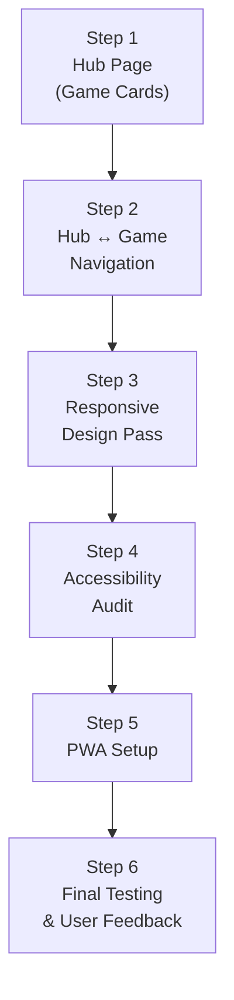

# Document 6: Phase 4 Micro-Plan — Polish & Hub Integration

> **Game:** Tango  
> **Phase:** 4 of 4 — Polish & Hub Integration  
> **Depends On:** Phase 1 (logic), Phase 2 (UI), Phase 3 (daily system) all complete  
> **Goal:** Hub page, responsive polish, accessibility, PWA, final E2E tests, user feedback  
> **Steps:** 6 sequential steps  
> **Testing:** Playwright E2E + visual browser audit + user feedback  

---

## Step Map



---

## Step 1: Hub Page — Game Cards

### Objective
Build the central hub page that displays all 4 game cards with icons, streak badges, and daily status. This is the first thing the user sees.

### Files

| File | Responsibility |
|------|----------------|
| `src/hub/hub.js` | Hub page renderer: card grid, status loading |
| `src/styles/hub.css` | Hub page styles |
| `src/hub/game-icons.js` | SVG/CSS game icon components |

### 1.1 — Hub Layout

```
┌──────────────────────────────────────┐
│                                      │
│          🎮 LinkedIn Games           │  ← Title
│                                      │
│   ┌────────────┐  ┌────────────┐     │
│   │   [icon]   │  │   [icon]   │     │
│   │            │  │            │     │
│   │   Tango    │  │   Queens   │     │  ← 2×2 card grid
│   │   🔥 5     │  │   🔥 —     │     │
│   │ Solve → /✓ │  │  Coming →  │     │
│   └────────────┘  └────────────┘     │
│                                      │
│   ┌────────────┐  ┌────────────┐     │
│   │   [icon]   │  │   [icon]   │     │
│   │            │  │            │     │
│   │  Sudoku    │  │    Zip     │     │
│   │   🔥 —     │  │   🔥 —     │     │
│   │  Coming →  │  │  Coming →  │     │
│   └────────────┘  └────────────┘     │
│                                      │
└──────────────────────────────────────┘
```

### 1.2 — Game Card States

Each card has 3 possible states based on game availability and daily status:

| State | Visual | Condition |
|-------|--------|-----------|
| **Available — Not played** | "Solve [Game] →" with accent-blue arrow | Game is built, today not completed |
| **Available — Completed** | "Completed ✓" with accent-green check | Game is built, today's puzzle solved |
| **Coming Soon** | "Coming Soon" greyed out, card at 50% opacity | Game not yet built |

### 1.3 — Game Card DOM Structure

```html
<div class="hub-card" data-game="tango" id="hub-card-tango">
  <div class="hub-card__icon">
    <!-- Game-specific icon (CSS or SVG) -->
  </div>
  <h2 class="hub-card__title">Tango</h2>
  <div class="hub-card__streak">🔥 5</div>
  <div class="hub-card__status">
    <span class="hub-card__cta">Solve Tango →</span>
  </div>
</div>
```

### 1.4 — Hub CSS (`hub.css`)

```css
.hub-page {
  display: flex;
  flex-direction: column;
  align-items: center;
  width: 100%;
  max-width: 480px;
  gap: var(--space-xl);
  padding-top: var(--space-2xl);
}

.hub-title {
  font-size: 24px;
  font-weight: 700;
  letter-spacing: 0.5px;
  color: var(--text-primary);
}

.hub-grid {
  display: grid;
  grid-template-columns: 1fr 1fr;
  gap: var(--space-md);
  width: 100%;
}

.hub-card {
  display: flex;
  flex-direction: column;
  align-items: center;
  gap: var(--space-sm);
  padding: var(--space-lg) var(--space-md);
  background: var(--bg-secondary);
  border-radius: var(--radius-lg);
  cursor: pointer;
  transition: background var(--dur-fast), transform var(--dur-fast),
              box-shadow var(--dur-normal);
  text-align: center;
}

.hub-card:hover {
  background: var(--bg-surface);
  transform: translateY(-2px);
  box-shadow: var(--shadow-md);
}

.hub-card:active {
  transform: translateY(0) scale(0.98);
}

/* Coming soon — disabled state */
.hub-card--disabled {
  opacity: 0.45;
  cursor: default;
  pointer-events: none;
}

.hub-card__icon {
  width: 48px;
  height: 48px;
  border-radius: var(--radius-md);
  display: flex;
  align-items: center;
  justify-content: center;
  font-size: 24px;
  /* Background color per game — set via inline style or modifier */
}

/* Per-game icon backgrounds */
.hub-card__icon--tango    { background: linear-gradient(135deg, var(--sun-gold), var(--moon-purple)); }
.hub-card__icon--queens   { background: linear-gradient(135deg, var(--pastel-pink), var(--pastel-purple)); }
.hub-card__icon--sudoku   { background: linear-gradient(135deg, var(--pastel-blue), var(--pastel-teal)); }
.hub-card__icon--zip      { background: linear-gradient(135deg, var(--pastel-orange), var(--accent-red)); }

.hub-card__title {
  font-size: 16px;
  font-weight: 600;
}

.hub-card__streak {
  font-size: 14px;
  color: var(--accent-orange);
  font-weight: 500;
}

/* Hide streak if no streak yet */
.hub-card__streak:empty {
  display: none;
}

.hub-card__cta {
  font-size: 13px;
  color: var(--accent-blue);
  font-weight: 500;
}

.hub-card__cta--completed {
  color: var(--accent-green);
}

.hub-card__cta--coming {
  color: var(--text-muted);
}

/* === Mobile: stack to 1 column on very small screens === */
@media (max-width: 320px) {
  .hub-grid {
    grid-template-columns: 1fr;
  }
}
```

### 1.5 — Game Icons

Simple CSS-drawn mini-icons that match the LinkedIn screenshot aesthetic:

| Game | Icon Approach |
|------|---------------|
| **Tango** | 2×2 mini-grid with sun (gold dot) and moon (purple crescent) |
| **Queens** | 2×2 colored region squares with a tiny crown |
| **Sudoku** | Mini 3×2 grid with numbers "1 2 / 3 ·" |
| **Zip** | Diagonal line with numbered dots (path preview) |

> [!NOTE]
> These icons are CSS-only (no image assets). They're simple, small, and match the dark-on-dark aesthetic. No need for SVG complexity — these are thumbnail representations at 48×48px.

### 1.6 — Hub Data Loading

```js
// hub.js
import { getStreak, isCompletedToday } from '../shared/streak.js';

const GAMES = [
  { id: 'tango',  name: 'Tango',      route: '/tango',  available: true },
  { id: 'queens', name: 'Queens',     route: '/queens', available: false },
  { id: 'sudoku', name: 'Sudoku',     route: '/sudoku', available: false },
  { id: 'zip',    name: 'Zip',        route: '/zip',    available: false },
];

export function mount(container) {
  const cards = GAMES.map(game => {
    const streak = game.available ? getStreak(game.id) : null;
    const completed = game.available ? isCompletedToday(game.id) : false;
    
    return buildCard({
      ...game,
      streak: streak?.current || 0,
      completed,
    });
  });
  
  // Render hub page with cards
  // Wire click handlers: navigate(game.route)
}
```

### Checkpoint 1

| Check | Pass Criteria |
|-------|---------------|
| Hub renders | 2×2 card grid visible on dark background |
| Tango card active | Shows "Solve Tango →" or "Completed ✓" based on daily state |
| Other cards disabled | Queens, Sudoku, Zip show "Coming Soon" at 50% opacity |
| Streak badge | Tango card shows 🔥 N if streak > 0, hidden if 0 |
| Card hover | Lift effect (translateY -2px + shadow) on hover |
| Card click | Tango card navigates to `#/tango` |
| Disabled cards | No click/hover response |

---

## Step 2: Hub ↔ Game Navigation

### Objective
Polish the navigation flow between hub and game, ensuring state syncs correctly.

### 2.1 — Navigation Flows

```
Hub → Click "Solve Tango →" → #/tango (game loads)
Game → Click "← Back" → #/ (hub loads, card status refreshes)
Game → Win → Modal → "Hub →" → #/ (hub loads, card shows "Completed ✓")
Game → Win → Modal → "New Puzzle" → stays on #/tango (non-daily practice puzzle)
```

### 2.2 — Status Sync

When navigating back to the hub, the hub must re-read localStorage to show updated status:

```js
// hub.js — mount() is called every time we navigate to #/
// So it always reads fresh streak/completion data from storage
export function mount(container) {
  // Fresh read every time — no stale state
  const cards = GAMES.map(game => {
    const streak = game.available ? getStreak(game.id) : null;
    const completed = game.available ? isCompletedToday(game.id) : false;
    return buildCard({ ...game, streak: streak?.current || 0, completed });
  });
  // ...
}
```

### 2.3 — Router Enhancement: Page Transitions

Add a subtle fade transition between hub and game:

```css
.page-enter {
  opacity: 0;
  transform: translateY(8px);
}
.page-enter-active {
  opacity: 1;
  transform: translateY(0);
  transition: opacity 200ms ease-out, transform 200ms ease-out;
}
```

```js
// router.js — on navigate:
async function navigateTo(path) {
  if (currentModule) {
    currentModule.unmount();
  }
  
  container.innerHTML = '';
  container.classList.add('page-enter');
  
  const module = routes[path] || routes['/'];
  await module.mount(container);
  currentModule = module;
  
  // Trigger reflow then animate
  requestAnimationFrame(() => {
    container.classList.remove('page-enter');
    container.classList.add('page-enter-active');
    setTimeout(() => container.classList.remove('page-enter-active'), 200);
  });
}
```

### Checkpoint 2

| Check | Pass Criteria |
|-------|---------------|
| Hub → Game | Click card → game loads with smooth fade |
| Game → Hub (back) | Back button → hub loads with updated card status |
| Win → Hub | Complete puzzle → modal → "Hub →" → hub shows "Completed ✓" |
| No stale state | Hub always shows current streak/completion from storage |
| Page transition | Subtle fade-up animation (200ms) between views |

---

## Step 3: Responsive Design Pass

### Objective
Ensure the entire app works beautifully on mobile, tablet, and desktop.

### 3.1 — Breakpoints

| Range | Target | Adjustments |
|-------|--------|-------------|
| `≤ 320px` | Small phone | Hub cards: 1 column. Grid cells: 44px |
| `321–400px` | Standard phone | Hub cards: 2 columns. Grid cells: 48px |
| `401–768px` | Large phone / tablet | Grid cells: 56px. Comfortable spacing |
| `> 768px` | Desktop | Max-width 480px container. centered |

### 3.2 — Touch Targets

Every interactive element must have a **minimum 44×44px** tap target:

```css
/* Enforce on all tappable elements */
.tango-cell,
.game-controls__btn,
.hub-card,
.game-header__back,
.modal-btn {
  min-width: 44px;
  min-height: 44px;
}
```

### 3.3 — Safe Area Insets (Notched Phones)

```css
body {
  padding-left: env(safe-area-inset-left);
  padding-right: env(safe-area-inset-right);
  padding-bottom: env(safe-area-inset-bottom);
}
```

### 3.4 — Landscape Handling

```css
@media (orientation: landscape) and (max-height: 500px) {
  .game-page {
    flex-direction: row;
    gap: var(--space-xl);
  }
  .game-board {
    /* Grid takes left side */
    flex-shrink: 0;
  }
  .game-controls {
    /* Controls stack vertically on right */
    flex-direction: column;
  }
}
```

### 3.5 — Testing Viewports

| Viewport | Test Device |
|----------|-------------|
| 375×667 | iPhone SE |
| 390×844 | iPhone 14 |
| 360×800 | Android standard |
| 768×1024 | iPad |
| 1280×800 | Desktop |
| 667×375 | iPhone SE landscape |

### Checkpoint 3

| Check | Pass Criteria |
|-------|---------------|
| iPhone SE (375px) | Grid fits, cells ≥ 44px, no horizontal scroll |
| Android (360px) | Same as above |
| iPad (768px) | Centered, comfortable spacing |
| Desktop (1280px) | Centered in 480px max-width container |
| Landscape | Grid and controls rearrange appropriately |
| Notch phones | Content doesn't overlap safe areas |
| Tap targets | All buttons and cells ≥ 44×44px verified |

---

## Step 4: Accessibility Audit

### Objective
Ensure the game is usable with keyboard-only navigation and screen readers.

### 4.1 — ARIA Roles & Labels

```html
<!-- Grid -->
<div class="tango-grid" role="grid" aria-label="Tango puzzle. 6 by 6 grid.">
  <div class="tango-cell" 
       role="gridcell" 
       tabindex="0"
       aria-label="Row 1, Column 1. Empty."
       aria-roledescription="puzzle cell"
       data-row="0" data-col="0">
  </div>
  <!-- When filled: -->
  <div class="tango-cell tango-cell--sun" 
       role="gridcell" 
       tabindex="0"
       aria-label="Row 1, Column 2. Sun. Pre-filled."
       data-row="0" data-col="1">
    <span class="tango-cell__symbol" aria-hidden="true">...</span>
  </div>
</div>

<!-- Timer -->
<div class="game-header__timer" role="timer" aria-live="off" aria-label="Elapsed time">
  00:00
</div>
```

### 4.2 — Keyboard Navigation

| Key | Action |
|-----|--------|
| **Arrow keys** | Move focus between grid cells |
| **Enter / Space** | Tap cycle on focused cell (empty → sun → moon → empty) |
| **Backspace / Delete** | Clear focused cell |
| **Ctrl+Z** | Undo last move |
| **Escape** | Close modal / navigate back to hub |
| **Tab** | Move focus between major UI sections (header → grid → controls) |

```js
// Arrow key grid navigation
grid.addEventListener('keydown', (e) => {
  const cell = e.target.closest('.tango-cell');
  if (!cell) return;
  
  const row = parseInt(cell.dataset.row);
  const col = parseInt(cell.dataset.col);
  
  let nextRow = row, nextCol = col;
  
  switch (e.key) {
    case 'ArrowUp':    nextRow = Math.max(0, row - 1); break;
    case 'ArrowDown':  nextRow = Math.min(5, row + 1); break;
    case 'ArrowLeft':  nextCol = Math.max(0, col - 1); break;
    case 'ArrowRight': nextCol = Math.min(5, col + 1); break;
    case 'Enter': case ' ':
      e.preventDefault();
      handleCellTap(row, col);
      return;
    case 'Backspace': case 'Delete':
      e.preventDefault();
      clearCell(row, col);
      return;
    default: return;
  }
  
  e.preventDefault();
  const nextCell = grid.querySelector(`[data-row="${nextRow}"][data-col="${nextCol}"]`);
  nextCell?.focus();
});
```

### 4.3 — Screen Reader Announcements

Use an `aria-live` region for dynamic announcements:

```html
<div id="sr-announcements" class="sr-only" aria-live="assertive" aria-atomic="true"></div>
```

```js
function announce(message) {
  const el = document.getElementById('sr-announcements');
  el.textContent = '';
  requestAnimationFrame(() => { el.textContent = message; });
}

// Call on events:
// On valid placement: announce("Sun placed at row 2, column 3")
// On invalid: announce("Invalid placement. Would create 3 suns in a row.")
// On win: announce("Puzzle solved! Time: 2 minutes 34 seconds. Streak: 5 days.")
// On undo: announce("Move undone. Row 2, column 3 cleared.")
```

### 4.4 — Reduced Motion

```css
@media (prefers-reduced-motion: reduce) {
  *, *::before, *::after {
    animation-duration: 0.01ms !important;
    animation-iteration-count: 1 !important;
    transition-duration: 0.01ms !important;
  }
  
  /* Disable confetti entirely */
  .confetti-canvas {
    display: none;
  }
}
```

### 4.5 — Color Contrast Verification

| Element | Foreground | Background | Ratio | WCAG AA |
|---------|-----------|------------|-------|---------|
| Body text | #FFFFFF | #1B1F23 | 15.4:1 | ✅ Pass |
| Secondary text | #B0B0B0 | #1B1F23 | 8.5:1 | ✅ Pass |
| Muted text | #787878 | #1B1F23 | 4.6:1 | ✅ Pass (AA) |
| Sun symbol | #FFD54F | #3A3A3A | 5.2:1 | ✅ Pass |
| Moon symbol | #B39DDB | #3A3A3A | 4.6:1 | ✅ Pass (AA) |
| Accent blue | #70B5F9 | #1B1F23 | 7.2:1 | ✅ Pass |
| Error red | #E74C3C | #1B1F23 | 4.6:1 | ✅ Pass (AA) |

### Checkpoint 4

| Check | Pass Criteria |
|-------|---------------|
| Arrow key navigation | Focus moves correctly between cells in the grid |
| Enter/Space placement | Tap cycle works via keyboard |
| Tab order | Logical flow: back button → grid → controls |
| Screen reader | Announcements fire for placement, errors, wins |
| Reduced motion | Animations disabled, confetti hidden |
| Color contrast | All text pairs pass WCAG AA (4.5:1 minimum) |
| Focus indicators | Visible focus ring on all interactive elements |

---

## Step 5: PWA Setup

### Objective
Make the app installable and offline-capable using Vite's PWA plugin.

### 5.1 — Install Plugin

```bash
npm install --save-dev vite-plugin-pwa
```

### 5.2 — Update `vite.config.js`

```js
import { defineConfig } from 'vite';
import { VitePWA } from 'vite-plugin-pwa';

export default defineConfig({
  plugins: [
    VitePWA({
      registerType: 'autoUpdate',
      includeAssets: ['favicon.svg', 'icons/*.png'],
      manifest: {
        name: 'LinkedIn Games',
        short_name: 'LI Games',
        description: 'Daily puzzle games — Tango, Queens, Sudoku, Zip',
        theme_color: '#1B1F23',
        background_color: '#1B1F23',
        display: 'standalone',
        orientation: 'portrait',
        start_url: '/',
        icons: [
          { src: '/icons/icon-192.png', sizes: '192x192', type: 'image/png' },
          { src: '/icons/icon-512.png', sizes: '512x512', type: 'image/png' },
          { src: '/icons/icon-512.png', sizes: '512x512', type: 'image/png', purpose: 'maskable' },
        ],
      },
      workbox: {
        globPatterns: ['**/*.{js,css,html,json,svg,png}'],
        runtimeCaching: [
          {
            urlPattern: /^https:\/\/fonts\.googleapis\.com\/.*/i,
            handler: 'CacheFirst',
            options: {
              cacheName: 'google-fonts-cache',
              expiration: { maxEntries: 10, maxAgeSeconds: 60 * 60 * 24 * 365 },
            },
          },
          {
            urlPattern: /^https:\/\/fonts\.gstatic\.com\/.*/i,
            handler: 'CacheFirst',
            options: {
              cacheName: 'gstatic-fonts-cache',
              expiration: { maxEntries: 10, maxAgeSeconds: 60 * 60 * 24 * 365 },
            },
          },
        ],
      },
    }),
  ],
  test: {
    environment: 'jsdom',
    include: ['tests/**/*.test.js'],
  },
});
```

### 5.3 — PWA Icons

Create simple icons using the design system colors:

| File | Size | Content |
|------|------|---------|
| `public/icons/icon-192.png` | 192×192 | Dark bg (#1B1F23) with "LG" text in accent blue |
| `public/icons/icon-512.png` | 512×512 | Same, larger |
| `public/favicon.svg` | Any | Simple SVG version |

> [!NOTE]
> Generate icons using the `generate_image` tool during execution. Simple dark background with stylized "LG" monogram.

### 5.4 — Install Prompt (Optional Enhancement)

Custom "Add to Home Screen" banner at the bottom of the hub:

```html
<div class="install-banner" id="install-banner" hidden>
  <span>Install for offline play</span>
  <button class="install-banner__btn" id="install-btn">Install</button>
  <button class="install-banner__dismiss" id="install-dismiss">✕</button>
</div>
```

```js
let deferredPrompt;
window.addEventListener('beforeinstallprompt', (e) => {
  e.preventDefault();
  deferredPrompt = e;
  document.getElementById('install-banner').hidden = false;
});

document.getElementById('install-btn').addEventListener('click', async () => {
  if (deferredPrompt) {
    deferredPrompt.prompt();
    const { outcome } = await deferredPrompt.userChoice;
    deferredPrompt = null;
    document.getElementById('install-banner').hidden = true;
  }
});
```

### 5.5 — Offline Behavior

With `workbox` precaching all assets + puzzle JSON:
- **All game logic** works offline (JS is cached)
- **JSON bank** (20 puzzles) is cached on first visit
- **Algorithmically generated puzzles** work offline (seeded PRNG is client-side)
- **Fonts** cached for 1 year
- **No backend dependency** — everything is client-side

### Checkpoint 5

| Check | Pass Criteria |
|-------|---------------|
| Build succeeds | `npm run build` produces dist/ with service worker |
| Manifest correct | `/manifest.webmanifest` has correct name, theme_color, icons |
| Installable | Chrome DevTools > Application > Manifest shows "installable" |
| Offline works | Disconnect network → reload → app still works |
| Puzzle plays offline | Can generate and solve a puzzle with no network |
| Icons render | 192px and 512px icons load correctly |
| Install prompt | Banner appears on first eligible visit |

---

## Step 6: Final Testing & User Feedback

### Objective
Run comprehensive E2E tests, visual audits, performance checks, and collect user feedback.

### 6.1 — Playwright E2E Test Suite

Install Playwright:
```bash
npm install --save-dev @playwright/test
npx playwright install
```

**File: `e2e/tango.spec.js`**

```
E2E test scenarios:

1. Hub loads with Tango card
   → Navigate to localhost → hub visible → Tango card says "Solve Tango →"

2. Navigate to Tango game
   → Click Tango card → game shell renders → grid visible → timer shows 00:00

3. Place a symbol
   → Click empty cell → sun appears → timer starts

4. Tap cycle
   → Click sun cell → changes to moon → click again → clears

5. Invalid placement rejection
   → Force an invalid placement → cell shakes → symbol not placed

6. Undo works
   → Place sun → click undo → cell empties

7. Reset works
   → Place multiple symbols → click reset → all user symbols cleared

8. Win flow
   → Solve puzzle (programmatically fill correct solution) → confetti appears → modal shows

9. Modal interactions
   → Click "Hub →" → navigates to hub → Tango card shows "Completed ✓"

10. Save and resume
    → Place some symbols → refresh page → symbols still there → timer resumes

11. Daily reset
    → Complete puzzle → mock new day → reload → fresh puzzle

12. Streak tracking
    → Complete puzzle → check modal shows streak → navigate to hub → card shows streak

13. Practice mode
    → Win daily → "New Puzzle" → new puzzle loads, timer resets

14. Responsive
    → Set viewport to 375×667 → all elements visible, no scroll, cells ≥ 44px

15. Keyboard navigation
    → Tab to grid → arrow keys move focus → Enter places symbol
```

### 6.2 — Performance Audit

| Metric | Target | How to Test |
|--------|--------|-------------|
| Puzzle generation | < 500ms | Console.time in generator, test 20 puzzles |
| Animation FPS | 60fps | Chrome DevTools > Performance > record during confetti |
| First paint | < 1s | Lighthouse score |
| TTI (Time to Interactive) | < 2s | Lighthouse |
| Bundle size | < 100KB gzipped | `npm run build` → check dist size |
| localStorage usage | < 50KB per game | Inspect storage in DevTools |

### 6.3 — Visual Checklist (Browser Audit)

| Item | Check |
|------|-------|
| Dark theme | Background #1B1F23, no white flashes |
| Inter font | All text renders in Inter |
| Grid alignment | All cells perfectly aligned, no sub-pixel gaps |
| Constraint markers | Centered on cell borders, legible |
| Sun symbol | Gold circle with glow |
| Moon symbol | Purple crescent with glow |
| Confetti | Multi-colored, falls with gravity, cleans up |
| Modal | Slides in with spring animation, backdrop darkens |
| Hub cards | Gradient icons, hover lift, correct status |
| Streak badge | Fire emoji + number on hub cards and modal |
| Error shake | Smooth horizontal oscillation, not janky |
| Timer | Monospace font, zero-padded mm:ss |
| Back button | Blue text, visible, works |
| Buttons | Tactile press effect on click |

### 6.4 — User Feedback Request

After all automated tests pass and visual audit is clean, present the game to the user with these specific questions:

```markdown
## 🎮 Tango is Ready for Feedback!

Please play a few rounds and let me know:

1. **Vibe check:** Does it feel like playing on LinkedIn? What's off?
2. **Dark theme:** Is the color palette comfortable? Too dark? Too contrasty?
3. **Grid feel:** Are cells the right size? Easy to tap on mobile?
4. **Symbols:** Do the sun/moon icons read clearly? Any confusion?
5. **Constraint markers:** Are = and × visible enough between cells?
6. **Animations:** 
   - Is the error shake satisfying or annoying?
   - Does confetti feel celebratory?
   - Is the modal entrance smooth?
7. **Timer:** Should it be more/less prominent?
8. **Hub:** Does the card layout feel right?
9. **Pain points:** Anything frustrating or confusing?
10. **Missing:** Anything you expected to see that's not there?
```

### Checkpoint 6 — PHASE 4 COMPLETE / MILESTONE M1

| Check | Pass Criteria |
|-------|---------------|
| All E2E tests green | 15/15 scenarios pass |
| Performance targets met | Gen < 500ms, 60fps animations, < 100KB bundle |
| Visual audit clean | All 14 checklist items verified |
| Accessibility clean | Keyboard nav, screen reader, reduced motion, contrast |
| PWA installable | Chrome confirms installable + offline works |
| User feedback collected | User has played and provided feedback |
| **MILESTONE M1** | **Tango is fully playable as a daily puzzle game** |

---

## Phase 4 Complete Deliverables

| Component | Status |
|-----------|--------|
| Hub page | ✅ 2×2 card grid, streak badges, daily status |
| Navigation | ✅ Smooth transitions, state sync, back button |
| Responsive | ✅ Mobile-first, 44px tap targets, safe areas |
| Accessibility | ✅ ARIA, keyboard, screen reader, reduced motion |
| PWA | ✅ Installable, offline, service worker, manifest |
| E2E tests | ✅ 15 scenario Playwright suite |
| Performance | ✅ Sub-500ms gen, 60fps, <100KB bundle |
| User feedback | ✅ Structured feedback collected |

### 🎯 Milestone M1 Complete

**Tango is production-ready.** Next: Game 2 (Queens) — same Phase 1-4 pattern, reusing all shared infrastructure.

---

> [!TIP]
> **Commit strategy for Phase 4:**
> 1. `feat: hub page — game cards with streak badges`
> 2. `feat: hub ↔ game navigation + page transitions`
> 3. `fix: responsive design pass — mobile, tablet, desktop`
> 4. `feat: accessibility — ARIA, keyboard, screen reader, reduced motion`
> 5. `feat: PWA — manifest, service worker, offline, install prompt`
> 6. `test: E2E Playwright suite — 15 full-flow scenarios`
